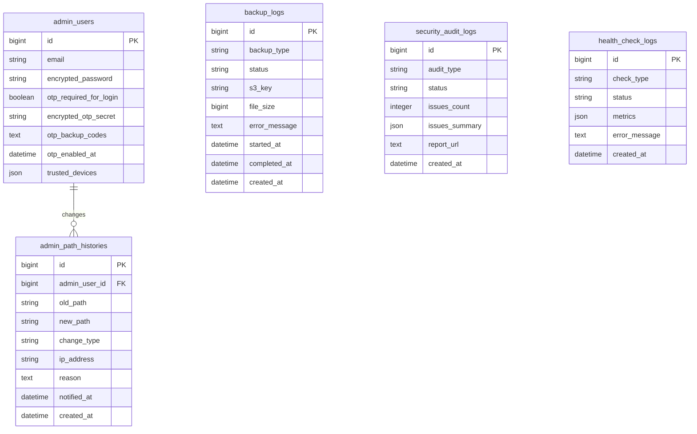

# Phase 7: セキュリティ・運用強化 - 設計書

## 📅 作成日: 2026-01-22
## 🎯 Phase: 7
## ⚡️ 優先度: 高
## 📊 ステータス: 設計中

---

## 📋 目次

1. [アーキテクチャ設計](#アーキテクチャ設計)
2. [データベース設計](#データベース設計)
3. [API設計](#api設計)
4. [セキュリティ設計](#セキュリティ設計)
5. [バックアップ設計](#バックアップ設計)
6. [監視設計](#監視設計)
7. [テスト戦略](#テスト戦略)
8. [実装計画](#実装計画)

---

## 🏗 アーキテクチャ設計

### システム構成図

```
┌─────────────────────────────────────────────────────────────┐
│                        Portfolio Site                        │
├─────────────────────────────────────────────────────────────┤
│                                                               │
│  ┌──────────────┐  ┌──────────────┐  ┌──────────────┐      │
│  │   2FA Auth   │  │  URL Manager │  │   Backup     │      │
│  │  (Devise)    │  │  (Rotation)  │  │  (Sidekiq)   │      │
│  └──────────────┘  └──────────────┘  └──────────────┘      │
│         │                  │                  │              │
│         ├──────────────────┼──────────────────┤              │
│         │                  │                  │              │
│  ┌──────▼──────────────────▼──────────────────▼──────┐      │
│  │           PostgreSQL Database                      │      │
│  │  - admin_users (2FA columns)                       │      │
│  │  - admin_path_histories                            │      │
│  │  - backup_logs                                     │      │
│  └────────────────────────────────────────────────────┘      │
│                                                               │
│  ┌────────────────────────────────────────────────────┐      │
│  │              External Services                      │      │
│  │  - AWS S3 (Backup Storage)                         │      │
│  │  - AWS SES (Email Notifications)                   │      │
│  │  - GitHub Actions (Security Audit)                 │      │
│  │  - UptimeRobot (Uptime Monitoring)                 │      │
│  └────────────────────────────────────────────────────┘      │
│                                                               │
└─────────────────────────────────────────────────────────────┘
```

### コンポーネント設計

#### 1. 2段階認証（2FA）
- **gem**: devise-two-factor, rqrcode
- **方式**: TOTP（Time-based One-Time Password）
- **統合**: 既存のDevise認証に追加

#### 2. 管理画面URL管理
- **動的変更**: 環境変数 `ADMIN_PATH` の更新
- **自動ローテーション**: Sidekiq-cronでスケジュール実行
- **履歴管理**: admin_path_historiesテーブル

#### 3. 自動バックアップ
- **実行**: Sidekiq-cronでスケジュール実行
- **保存先**: AWS S3
- **世代管理**: S3 Lifecycle Policy

#### 4. セキュリティ監査
- **実行**: GitHub Actions（日次）
- **ツール**: Brakeman, bundler-audit
- **通知**: メール、Slack（オプション）

#### 5. 監視機能
- **ヘルスチェック**: `/health` エンドポイント
- **ダッシュボード**: 管理画面に統合
- **外部監視**: UptimeRobot

---

## 🗄 データベース設計

### 新規テーブル

#### 1. admin_path_histories（管理画面URL履歴）

```ruby
create_table :admin_path_histories do |t|
  t.string :old_path, null: false
  t.string :new_path, null: false
  t.string :change_type, null: false # manual, auto_rotation, emergency
  t.references :admin_user, null: false, foreign_key: true
  t.string :ip_address
  t.text :reason
  t.datetime :notified_at
  t.timestamps
end

add_index :admin_path_histories, :old_path
add_index :admin_path_histories, :new_path
add_index :admin_path_histories, :created_at
```

#### 2. backup_logs（バックアップログ）

```ruby
create_table :backup_logs do |t|
  t.string :backup_type, null: false # daily, weekly, monthly
  t.string :status, null: false # pending, running, success, failed
  t.string :s3_key
  t.bigint :file_size
  t.text :error_message
  t.datetime :started_at
  t.datetime :completed_at
  t.timestamps
end

add_index :backup_logs, :backup_type
add_index :backup_logs, :status
add_index :backup_logs, :created_at
```

#### 3. security_audit_logs（セキュリティ監査ログ）

```ruby
create_table :security_audit_logs do |t|
  t.string :audit_type, null: false # brakeman, bundler_audit
  t.string :status, null: false # success, warning, error
  t.integer :issues_count, default: 0
  t.json :issues_summary
  t.text :report_url
  t.timestamps
end

add_index :security_audit_logs, :audit_type
add_index :security_audit_logs, :status
add_index :security_audit_logs, :created_at
```

#### 4. health_check_logs（ヘルスチェックログ）

```ruby
create_table :health_check_logs do |t|
  t.string :check_type, null: false # database, redis, disk, memory
  t.string :status, null: false # healthy, warning, critical
  t.json :metrics
  t.text :error_message
  t.timestamps
end

add_index :health_check_logs, :check_type
add_index :health_check_logs, :status
add_index :health_check_logs, :created_at
```

### 既存テーブル拡張

#### admin_users（2FA対応）

```ruby
# devise-two-factor gem が自動追加するカラム
add_column :admin_users, :encrypted_otp_secret, :string
add_column :admin_users, :encrypted_otp_secret_iv, :string
add_column :admin_users, :encrypted_otp_secret_salt, :string
add_column :admin_users, :consumed_timestep, :integer
add_column :admin_users, :otp_required_for_login, :boolean, default: false
add_column :admin_users, :otp_backup_codes, :text, array: true

# 追加カラム
add_column :admin_users, :otp_enabled_at, :datetime
add_column :admin_users, :trusted_devices, :json, default: []

add_index :admin_users, :otp_required_for_login
```

### ER図



---


## 🔌 API設計

### 内部API（管理画面用）

#### 1. 2FA管理API

**POST /admin/two_factor_auth/enable**
```ruby
# 2FA有効化
Request:
{
  "password": "current_password"
}

Response:
{
  "success": true,
  "qr_code": "data:image/png;base64,...",
  "secret": "BASE32SECRET",
  "backup_codes": ["code1", "code2", ...]
}
```

**POST /admin/two_factor_auth/verify**
```ruby
# 2FA確認
Request:
{
  "otp_code": "123456"
}

Response:
{
  "success": true,
  "message": "2FA enabled successfully"
}
```

**DELETE /admin/two_factor_auth/disable**
```ruby
# 2FA無効化
Request:
{
  "password": "current_password",
  "otp_code": "123456"
}

Response:
{
  "success": true,
  "message": "2FA disabled successfully"
}
```

#### 2. 管理画面URL管理API

**GET /admin/admin_path_settings**
```ruby
# 現在の設定取得
Response:
{
  "current_path": "admin-secure-panel-miyakawa2449",
  "rotation_enabled": true,
  "rotation_frequency": "monthly",
  "next_rotation_at": "2026-03-01T03:00:00+09:00",
  "histories": [
    {
      "id": 1,
      "old_path": "admin",
      "new_path": "admin-secure-panel-miyakawa2449",
      "change_type": "manual",
      "changed_at": "2026-01-22T10:00:00+09:00"
    }
  ]
}
```

**PUT /admin/admin_path_settings**
```ruby
# URL変更
Request:
{
  "new_path": "new-admin-path-2026",
  "reason": "Security enhancement"
}

Response:
{
  "success": true,
  "new_path": "new-admin-path-2026",
  "message": "Admin path updated successfully"
}
```

**POST /admin/admin_path_settings/emergency_rotation**
```ruby
# 緊急ローテーション
Request:
{
  "reason": "Suspicious access detected"
}

Response:
{
  "success": true,
  "new_path": "emergency-admin-abc123",
  "message": "Emergency rotation completed"
}
```

#### 3. バックアップ管理API

**GET /admin/backups**
```ruby
# バックアップ一覧
Response:
{
  "backups": [
    {
      "id": 1,
      "backup_type": "daily",
      "status": "success",
      "file_size": 2147483648,
      "s3_key": "daily/backup_20260122_030000.zip",
      "created_at": "2026-01-22T03:00:00+09:00"
    }
  ],
  "pagination": {
    "current_page": 1,
    "total_pages": 10,
    "total_count": 100
  }
}
```

**POST /admin/backups/restore**
```ruby
# バックアップ復元
Request:
{
  "backup_id": 1
}

Response:
{
  "success": true,
  "message": "Restore started. This may take several minutes."
}
```

**POST /admin/backups/manual**
```ruby
# 手動バックアップ
Request:
{
  "backup_type": "manual"
}

Response:
{
  "success": true,
  "message": "Manual backup started"
}
```

#### 4. 監視ダッシュボードAPI

**GET /admin/monitoring/dashboard**
```ruby
# ダッシュボードデータ取得
Response:
{
  "health_status": "healthy",
  "metrics": {
    "database": {
      "status": "healthy",
      "response_time_ms": 5
    },
    "redis": {
      "status": "healthy",
      "response_time_ms": 2
    },
    "disk": {
      "status": "warning",
      "used_percent": 75,
      "available_gb": 10
    },
    "memory": {
      "status": "healthy",
      "used_percent": 60
    }
  },
  "recent_backups": [...],
  "recent_security_audits": [...]
}
```

### 公開API

#### ヘルスチェックエンドポイント

**GET /health**
```ruby
# ヘルスチェック
Response:
{
  "status": "healthy",
  "timestamp": "2026-01-22T10:00:00+09:00",
  "checks": {
    "database": "ok",
    "redis": "ok",
    "disk": "ok",
    "memory": "ok"
  }
}
```

---

## 🔒 セキュリティ設計

### 2段階認証（2FA）

#### TOTP実装

```ruby
# app/models/admin_user.rb
class AdminUser < ApplicationRecord
  devise :two_factor_authenticatable,
         :otp_secret_encryption_key => ENV['OTP_SECRET_ENCRYPTION_KEY']
  
  # バックアップコード生成
  def generate_otp_backup_codes!
    codes = 10.times.map { SecureRandom.hex(5) }
    self.otp_backup_codes = codes.map { |code| Devise.bcrypt(AdminUser, code) }
    codes
  end
  
  # バックアップコード検証
  def validate_backup_code(code)
    otp_backup_codes.each_with_index do |backup_code, index|
      if Devise.secure_compare(backup_code, Devise.bcrypt(AdminUser, code))
        otp_backup_codes.delete_at(index)
        save!
        return true
      end
    end
    false
  end
  
  # デバイス信頼
  def trust_device!(device_token)
    trusted_devices << {
      token: device_token,
      expires_at: 30.days.from_now
    }
    save!
  end
  
  def device_trusted?(device_token)
    trusted_devices.any? do |device|
      device['token'] == device_token && 
      Time.parse(device['expires_at']) > Time.current
    end
  end
end
```

#### QRコード生成

```ruby
# app/services/two_factor_auth/qr_code_generator.rb
module TwoFactorAuth
  class QrCodeGenerator
    def initialize(admin_user)
      @admin_user = admin_user
    end
    
    def generate
      issuer = 'Portfolio Site'
      label = "#{issuer}:#{@admin_user.email}"
      
      provisioning_uri = @admin_user.otp_provisioning_uri(
        label,
        issuer: issuer
      )
      
      qrcode = RQRCode::QRCode.new(provisioning_uri)
      qrcode.as_png(size: 300).to_data_url
    end
  end
end
```

### 管理画面URL管理

#### URL変更サービス

```ruby
# app/services/admin_path/updater.rb
module AdminPath
  class Updater
    RESERVED_WORDS = %w[admin login logout dashboard api health].freeze
    
    def initialize(admin_user, new_path, reason: nil)
      @admin_user = admin_user
      @new_path = new_path
      @reason = reason
    end
    
    def update!
      validate_path!
      
      old_path = ENV['ADMIN_PATH']
      
      ActiveRecord::Base.transaction do
        # 環境変数更新
        update_env_file(old_path, @new_path)
        
        # 履歴記録
        AdminPathHistory.create!(
          admin_user: @admin_user,
          old_path: old_path,
          new_path: @new_path,
          change_type: 'manual',
          ip_address: @admin_user.current_sign_in_ip,
          reason: @reason
        )
        
        # メール通知
        AdminPathMailer.path_changed(
          @admin_user,
          old_path,
          @new_path
        ).deliver_later
      end
      
      # ルーティング再読み込み
      Rails.application.reload_routes!
      
      @new_path
    end
    
    private
    
    def validate_path!
      raise ArgumentError, 'Path cannot be blank' if @new_path.blank?
      raise ArgumentError, 'Path is reserved' if RESERVED_WORDS.include?(@new_path)
      raise ArgumentError, 'Path already exists' if AdminPathHistory.exists?(new_path: @new_path)
      raise ArgumentError, 'Path must be alphanumeric with hyphens' unless @new_path.match?(/\A[a-z0-9\-]+\z/)
    end
    
    def update_env_file(old_path, new_path)
      env_file = Rails.root.join('.env')
      content = File.read(env_file)
      content.gsub!(/ADMIN_PATH=#{old_path}/, "ADMIN_PATH=#{new_path}")
      File.write(env_file, content)
      ENV['ADMIN_PATH'] = new_path
    end
  end
end
```

#### 自動ローテーション

```ruby
# app/jobs/admin_path/rotation_job.rb
module AdminPath
  class RotationJob < ApplicationJob
    queue_as :default
    
    def perform
      return unless rotation_enabled?
      
      # 24時間前に通知
      if should_notify?
        notify_upcoming_rotation
        return
      end
      
      # ローテーション実行
      if should_rotate?
        execute_rotation
      end
    end
    
    private
    
    def rotation_enabled?
      SiteSetting.get('admin_path_rotation_enabled') == 'true'
    end
    
    def should_notify?
      next_rotation = SiteSetting.get('next_admin_path_rotation_at')
      return false unless next_rotation
      
      Time.parse(next_rotation) - 24.hours <= Time.current
    end
    
    def should_rotate?
      next_rotation = SiteSetting.get('next_admin_path_rotation_at')
      return false unless next_rotation
      
      Time.parse(next_rotation) <= Time.current
    end
    
    def notify_upcoming_rotation
      AdminUser.find_each do |admin_user|
        AdminPathMailer.rotation_notification(admin_user).deliver_later
      end
    end
    
    def execute_rotation
      new_path = generate_random_path
      admin_user = AdminUser.first # システムユーザー
      
      AdminPath::Updater.new(
        admin_user,
        new_path,
        reason: 'Automatic rotation'
      ).update!
      
      # 次回ローテーション日時を設定
      frequency = SiteSetting.get('admin_path_rotation_frequency')
      next_rotation = calculate_next_rotation(frequency)
      SiteSetting.set('next_admin_path_rotation_at', next_rotation.iso8601)
    end
    
    def generate_random_path
      "admin-#{SecureRandom.hex(8)}"
    end
    
    def calculate_next_rotation(frequency)
      case frequency
      when 'daily'
        1.day.from_now
      when 'weekly'
        1.week.from_now
      when 'monthly'
        1.month.from_now
      else
        1.month.from_now
      end
    end
  end
end
```

---


## 💾 バックアップ設計

### バックアップアーキテクチャ

```
┌─────────────────────────────────────────────────────────────┐
│                    Backup System                             │
├─────────────────────────────────────────────────────────────┤
│                                                               │
│  ┌──────────────────────────────────────────────────────┐   │
│  │         Sidekiq-cron Scheduler                       │   │
│  │  - Daily: 03:00 JST                                  │   │
│  │  - Weekly: Sunday 03:00 JST                          │   │
│  │  - Monthly: 1st day 03:00 JST                        │   │
│  └──────────────────┬───────────────────────────────────┘   │
│                     │                                         │
│                     ▼                                         │
│  ┌──────────────────────────────────────────────────────┐   │
│  │         Backup::CreateJob                            │   │
│  │  1. Create database dump (pg_dump)                   │   │
│  │  2. Compress with gzip                               │   │
│  │  3. Copy Active Storage files                        │   │
│  │  4. Copy config files                                │   │
│  │  5. Create ZIP archive                               │   │
│  └──────────────────┬───────────────────────────────────┘   │
│                     │                                         │
│                     ▼                                         │
│  ┌──────────────────────────────────────────────────────┐   │
│  │         Backup::S3Uploader                           │   │
│  │  - Upload to S3 with encryption                      │   │
│  │  - Generate S3 key                                   │   │
│  │  - Record backup log                                 │   │
│  └──────────────────┬───────────────────────────────────┘   │
│                     │                                         │
│                     ▼                                         │
│  ┌──────────────────────────────────────────────────────┐   │
│  │         AWS S3 Bucket                                │   │
│  │  portfolio-backup-miyakawa2449                       │   │
│  │  - daily/backup_YYYYMMDD_HHMMSS.zip                 │   │
│  │  - weekly/backup_YYYYMMDD_HHMMSS.zip                │   │
│  │  - monthly/backup_YYYYMMDD_HHMMSS.zip               │   │
│  └──────────────────────────────────────────────────────┘   │
│                                                               │
└─────────────────────────────────────────────────────────────┘
```

### バックアップサービス実装

#### 1. バックアップ作成

```ruby
# app/services/backup/creator.rb
module Backup
  class Creator
    def initialize(backup_type)
      @backup_type = backup_type
      @timestamp = Time.current.strftime('%Y%m%d_%H%M%S')
      @temp_dir = Rails.root.join('tmp', 'backups', @timestamp)
    end
    
    def create!
      backup_log = BackupLog.create!(
        backup_type: @backup_type,
        status: 'running',
        started_at: Time.current
      )
      
      begin
        FileUtils.mkdir_p(@temp_dir)
        
        # 1. データベースバックアップ
        dump_database
        
        # 2. Active Storageバックアップ
        copy_active_storage
        
        # 3. 設定ファイルバックアップ
        copy_config_files
        
        # 4. ZIP圧縮
        zip_file = create_zip_archive
        
        # 5. S3アップロード
        s3_key = upload_to_s3(zip_file)
        
        # 6. ログ更新
        backup_log.update!(
          status: 'success',
          s3_key: s3_key,
          file_size: File.size(zip_file),
          completed_at: Time.current
        )
        
        # 7. 通知
        BackupMailer.backup_success(backup_log).deliver_later
        
        backup_log
      rescue => e
        backup_log.update!(
          status: 'failed',
          error_message: e.message,
          completed_at: Time.current
        )
        
        BackupMailer.backup_failed(backup_log, e).deliver_later
        
        raise
      ensure
        # 一時ファイル削除
        FileUtils.rm_rf(@temp_dir)
      end
    end
    
    private
    
    def dump_database
      db_config = Rails.configuration.database_configuration[Rails.env]
      dump_file = @temp_dir.join('database.sql.gz')
      
      cmd = [
        'pg_dump',
        '-h', db_config['host'],
        '-U', db_config['username'],
        '-d', db_config['database'],
        '-Fc',
        '|',
        'gzip',
        '>',
        dump_file.to_s
      ].join(' ')
      
      system(cmd) || raise('Database dump failed')
    end
    
    def copy_active_storage
      storage_dir = Rails.root.join('storage')
      dest_dir = @temp_dir.join('storage')
      
      FileUtils.cp_r(storage_dir, dest_dir) if storage_dir.exist?
    end
    
    def copy_config_files
      config_dir = @temp_dir.join('config')
      FileUtils.mkdir_p(config_dir)
      
      # .env
      FileUtils.cp(Rails.root.join('.env'), config_dir) if File.exist?(Rails.root.join('.env'))
      
      # credentials.yml.enc
      credentials_file = Rails.root.join('config', 'credentials.yml.enc')
      FileUtils.cp(credentials_file, config_dir) if credentials_file.exist?
      
      # master.key
      master_key = Rails.root.join('config', 'master.key')
      FileUtils.cp(master_key, config_dir) if master_key.exist?
    end
    
    def create_zip_archive
      zip_file = Rails.root.join('tmp', "backup_#{@timestamp}.zip")
      
      Zip::File.open(zip_file, Zip::File::CREATE) do |zipfile|
        Dir.glob("#{@temp_dir}/**/*").each do |file|
          next if File.directory?(file)
          
          zipfile.add(
            file.sub("#{@temp_dir}/", ''),
            file
          )
        end
      end
      
      zip_file
    end
    
    def upload_to_s3(zip_file)
      uploader = Backup::S3Uploader.new
      uploader.upload(zip_file, @backup_type)
    end
  end
end
```

#### 2. S3アップロード

```ruby
# app/services/backup/s3_uploader.rb
module Backup
  class S3Uploader
    def initialize
      @s3_client = Aws::S3::Client.new(region: ENV['AWS_REGION'])
      @bucket = ENV['S3_BACKUP_BUCKET']
    end
    
    def upload(file_path, backup_type)
      key = generate_key(backup_type)
      
      File.open(file_path, 'rb') do |file|
        @s3_client.put_object(
          bucket: @bucket,
          key: key,
          body: file,
          server_side_encryption: 'AES256',
          metadata: {
            'backup-type' => backup_type,
            'created-at' => Time.current.iso8601
          }
        )
      end
      
      Rails.logger.info "Backup uploaded: #{key}"
      key
    end
    
    def download(s3_key, dest_path)
      @s3_client.get_object(
        bucket: @bucket,
        key: s3_key,
        response_target: dest_path
      )
      
      Rails.logger.info "Backup downloaded: #{s3_key}"
      dest_path
    end
    
    def list_backups(backup_type = nil)
      prefix = backup_type ? "#{backup_type}/" : ''
      
      response = @s3_client.list_objects_v2(
        bucket: @bucket,
        prefix: prefix
      )
      
      response.contents.map do |object|
        {
          key: object.key,
          size: object.size,
          last_modified: object.last_modified
        }
      end
    end
    
    private
    
    def generate_key(backup_type)
      timestamp = Time.current.strftime('%Y%m%d_%H%M%S')
      "#{backup_type}/backup_#{timestamp}.zip"
    end
  end
end
```

#### 3. バックアップ復元

```ruby
# app/services/backup/restorer.rb
module Backup
  class Restorer
    def initialize(backup_log)
      @backup_log = backup_log
      @temp_dir = Rails.root.join('tmp', 'restore', Time.current.to_i.to_s)
    end
    
    def restore!
      begin
        FileUtils.mkdir_p(@temp_dir)
        
        # 1. S3からダウンロード
        zip_file = download_from_s3
        
        # 2. ZIP解凍
        extract_zip(zip_file)
        
        # 3. データベース復元
        restore_database
        
        # 4. Active Storage復元
        restore_active_storage
        
        # 5. 設定ファイル復元（オプション）
        # restore_config_files
        
        Rails.logger.info "Restore completed: #{@backup_log.s3_key}"
        
        # 6. 通知
        BackupMailer.restore_success(@backup_log).deliver_later
        
        true
      rescue => e
        Rails.logger.error "Restore failed: #{e.message}"
        BackupMailer.restore_failed(@backup_log, e).deliver_later
        raise
      ensure
        FileUtils.rm_rf(@temp_dir)
      end
    end
    
    private
    
    def download_from_s3
      zip_file = @temp_dir.join('backup.zip')
      uploader = Backup::S3Uploader.new
      uploader.download(@backup_log.s3_key, zip_file)
      zip_file
    end
    
    def extract_zip(zip_file)
      Zip::File.open(zip_file) do |zip|
        zip.each do |entry|
          dest_path = @temp_dir.join(entry.name)
          FileUtils.mkdir_p(File.dirname(dest_path))
          entry.extract(dest_path)
        end
      end
    end
    
    def restore_database
      db_config = Rails.configuration.database_configuration[Rails.env]
      dump_file = @temp_dir.join('database.sql.gz')
      
      # データベース削除・再作成
      ActiveRecord::Base.connection.execute('DROP SCHEMA public CASCADE')
      ActiveRecord::Base.connection.execute('CREATE SCHEMA public')
      
      # リストア
      cmd = [
        'gunzip',
        '-c',
        dump_file.to_s,
        '|',
        'pg_restore',
        '-h', db_config['host'],
        '-U', db_config['username'],
        '-d', db_config['database'],
        '--no-owner',
        '--no-acl'
      ].join(' ')
      
      system(cmd) || raise('Database restore failed')
    end
    
    def restore_active_storage
      storage_dir = @temp_dir.join('storage')
      dest_dir = Rails.root.join('storage')
      
      if storage_dir.exist?
        FileUtils.rm_rf(dest_dir)
        FileUtils.cp_r(storage_dir, dest_dir)
      end
    end
  end
end
```

### Sidekiq-cronスケジュール

```yaml
# config/schedule.yml
backup_daily:
  cron: "0 3 * * *"  # 毎日午前3時
  class: "Backup::CreateJob"
  args: ["daily"]
  queue: default

backup_weekly:
  cron: "0 3 * * 0"  # 毎週日曜日午前3時
  class: "Backup::CreateJob"
  args: ["weekly"]
  queue: default

backup_monthly:
  cron: "0 3 1 * *"  # 毎月1日午前3時
  class: "Backup::CreateJob"
  args: ["monthly"]
  queue: default

admin_path_rotation:
  cron: "0 */6 * * *"  # 6時間ごとにチェック
  class: "AdminPath::RotationJob"
  queue: default

security_audit:
  cron: "0 4 * * *"  # 毎日午前4時
  class: "Security::AuditJob"
  queue: default
```

---

## 📧 通知設計

### 通知先設定

#### Phase 7での実装
Phase 7では環境変数で通知先を設定します：

```bash
# メイン通知先（一般的な通知）
ADMIN_EMAIL=your-admin-email@example.com

# セキュリティ関連通知先
SECURITY_AUDIT_EMAIL=your-security-email@example.com

# Slack通知（既存のSlackNotifierを拡張）
SLACK_WEBHOOK_URL=your-slack-webhook-url-here
```

**注意**: 実際のメールアドレスとSlack Webhook URLは`.env`ファイルに設定してください。仕様書やGitリポジトリには含めないでください。

#### Phase 7.5での実装予定
Phase 7.5でユーザー管理機能を実装する際、スーパーユーザーのemailカラムと紐づけます：

- スーパーユーザー作成時に通知先メールアドレスを登録
- 複数管理者対応時は権限に応じて通知先を振り分け
- 環境変数からデータベース管理への移行

### 通知の種類と送信先

| 通知種類 | メール送信先 | Slack通知 | 優先度 |
|---------|------------|----------|--------|
| 2FA有効化/無効化 | ADMIN_EMAIL | ✅ | 高 |
| 管理画面URL変更 | ADMIN_EMAIL | ✅ | 高 |
| URL自動ローテーション予告 | ADMIN_EMAIL | ✅ | 高 |
| バックアップ成功 | ADMIN_EMAIL | ✅ | 中 |
| バックアップ失敗 | ADMIN_EMAIL | ✅ | 高 |
| 復元完了 | ADMIN_EMAIL | ✅ | 高 |
| セキュリティ脆弱性検知 | SECURITY_AUDIT_EMAIL | ✅ | 高 |
| 週次セキュリティレポート | SECURITY_AUDIT_EMAIL | ❌ | 中 |
| ヘルスチェック異常 | ADMIN_EMAIL | ✅ | 高 |
| ディスク容量警告 | ADMIN_EMAIL | ✅ | 中 |

### Slack通知の実装

既存の`SlackNotifier`サービスを拡張して、Phase 7の通知に対応します：

```ruby
# app/services/slack_notifier.rb（既存サービスの拡張）
class SlackNotifier
  # 既存のメソッド
  # def self.notify_contact(contact)
  # ...
  
  # Phase 7で追加するメソッド
  
  def self.notify_2fa_changed(admin_user, action)
    return unless enabled?
    
    message = {
      text: "🔐 2FA設定変更",
      attachments: [{
        color: action == 'enabled' ? 'good' : 'warning',
        fields: [
          { title: "管理者", value: admin_user.email, short: true },
          { title: "アクション", value: action == 'enabled' ? '有効化' : '無効化', short: true },
          { title: "日時", value: Time.current.strftime('%Y-%m-%d %H:%M:%S'), short: true }
        ]
      }]
    }
    
    send_notification(message)
  end
  
  def self.notify_admin_path_changed(admin_user, old_path, new_path, change_type)
    return unless enabled?
    
    message = {
      text: "🔗 管理画面URL変更",
      attachments: [{
        color: change_type == 'emergency' ? 'danger' : 'warning',
        fields: [
          { title: "変更者", value: admin_user.email, short: true },
          { title: "変更タイプ", value: change_type, short: true },
          { title: "旧URL", value: "/#{old_path}", short: true },
          { title: "新URL", value: "/#{new_path}", short: true },
          { title: "日時", value: Time.current.strftime('%Y-%m-%d %H:%M:%S'), short: true }
        ]
      }]
    }
    
    send_notification(message)
  end
  
  def self.notify_backup_status(backup_log)
    return unless enabled?
    
    color = case backup_log.status
            when 'success' then 'good'
            when 'failed' then 'danger'
            else 'warning'
            end
    
    message = {
      text: "💾 バックアップ#{backup_log.status == 'success' ? '成功' : '失敗'}",
      attachments: [{
        color: color,
        fields: [
          { title: "タイプ", value: backup_log.backup_type, short: true },
          { title: "ステータス", value: backup_log.status, short: true },
          { title: "ファイルサイズ", value: "#{(backup_log.file_size.to_f / 1024 / 1024).round(2)} MB", short: true },
          { title: "日時", value: backup_log.created_at.strftime('%Y-%m-%d %H:%M:%S'), short: true }
        ]
      }]
    }
    
    if backup_log.status == 'failed'
      message[:attachments][0][:fields] << {
        title: "エラー",
        value: backup_log.error_message,
        short: false
      }
    end
    
    send_notification(message)
  end
  
  def self.notify_security_issue(audit_log)
    return unless enabled?
    
    message = {
      text: "⚠️ セキュリティ脆弱性検知",
      attachments: [{
        color: 'danger',
        fields: [
          { title: "監査タイプ", value: audit_log.audit_type, short: true },
          { title: "問題数", value: audit_log.issues_count.to_s, short: true },
          { title: "日時", value: audit_log.created_at.strftime('%Y-%m-%d %H:%M:%S'), short: true }
        ]
      }]
    }
    
    send_notification(message)
  end
  
  def self.notify_health_check_alert(check_type, status, metrics)
    return unless enabled?
    
    message = {
      text: "🚨 ヘルスチェック異常",
      attachments: [{
        color: status == 'critical' ? 'danger' : 'warning',
        fields: [
          { title: "チェック種類", value: check_type, short: true },
          { title: "ステータス", value: status, short: true },
          { title: "メトリクス", value: metrics.to_json, short: false },
          { title: "日時", value: Time.current.strftime('%Y-%m-%d %H:%M:%S'), short: true }
        ]
      }]
    }
    
    send_notification(message)
  end
  
  private
  
  def self.enabled?
    ENV['SLACK_WEBHOOK_URL'].present?
  end
  
  def self.send_notification(message)
    # 既存の実装を使用
    # ...
  end
end
```

### メール通知の実装

各機能ごとにMailerクラスを実装します：

#### 1. AdminPathMailer

```ruby
# app/mailers/admin_path_mailer.rb
class AdminPathMailer < ApplicationMailer
  default from: ENV['ADMIN_EMAIL']
  
  def path_changed(admin_user, old_path, new_path)
    @admin_user = admin_user
    @old_path = old_path
    @new_path = new_path
    
    mail(
      to: ENV['ADMIN_EMAIL'],
      subject: '【重要】管理画面URLが変更されました'
    )
    
    # Slack通知も送信
    SlackNotifier.notify_admin_path_changed(admin_user, old_path, new_path, 'manual')
  end
  
  def rotation_notification(admin_user)
    @admin_user = admin_user
    @next_rotation = SiteSetting.get('next_admin_path_rotation_at')
    
    mail(
      to: ENV['ADMIN_EMAIL'],
      subject: '【予告】管理画面URLが24時間後に自動変更されます'
    )
  end
end
```

#### 2. BackupMailer

```ruby
# app/mailers/backup_mailer.rb
class BackupMailer < ApplicationMailer
  default from: ENV['ADMIN_EMAIL']
  
  def backup_success(backup_log)
    @backup_log = backup_log
    
    mail(
      to: ENV['ADMIN_EMAIL'],
      subject: "バックアップ成功: #{backup_log.backup_type}"
    )
    
    # Slack通知も送信
    SlackNotifier.notify_backup_status(backup_log)
  end
  
  def backup_failed(backup_log, error)
    @backup_log = backup_log
    @error = error
    
    mail(
      to: ENV['ADMIN_EMAIL'],
      subject: "【緊急】バックアップ失敗: #{backup_log.backup_type}"
    )
    
    # Slack通知も送信
    SlackNotifier.notify_backup_status(backup_log)
  end
  
  def restore_success(backup_log)
    @backup_log = backup_log
    
    mail(
      to: ENV['ADMIN_EMAIL'],
      subject: 'バックアップ復元完了'
    )
  end
  
  def restore_failed(backup_log, error)
    @backup_log = backup_log
    @error = error
    
    mail(
      to: ENV['ADMIN_EMAIL'],
      subject: '【緊急】バックアップ復元失敗'
    )
  end
end
```

#### 3. SecurityMailer

```ruby
# app/mailers/security_mailer.rb
class SecurityMailer < ApplicationMailer
  default from: ENV['SECURITY_AUDIT_EMAIL']
  
  def brakeman_issues(result)
    @result = result
    
    mail(
      to: ENV['SECURITY_AUDIT_EMAIL'],
      subject: "【セキュリティ】Brakeman脆弱性検知: #{result['warnings'].size}件"
    )
    
    # Slack通知も送信
    audit_log = SecurityAuditLog.where(audit_type: 'brakeman').last
    SlackNotifier.notify_security_issue(audit_log) if audit_log
  end
  
  def bundler_audit_issues(result)
    @result = result
    
    mail(
      to: ENV['SECURITY_AUDIT_EMAIL'],
      subject: "【セキュリティ】bundler-audit脆弱性検知: #{result['results'].size}件"
    )
    
    # Slack通知も送信
    audit_log = SecurityAuditLog.where(audit_type: 'bundler_audit').last
    SlackNotifier.notify_security_issue(audit_log) if audit_log
  end
  
  def weekly_report(report)
    @report = report
    
    mail(
      to: ENV['SECURITY_AUDIT_EMAIL'],
      subject: "週次セキュリティレポート: #{report[:period]}"
    )
  end
end
```

#### 4. TwoFactorAuthMailer

```ruby
# app/mailers/two_factor_auth_mailer.rb
class TwoFactorAuthMailer < ApplicationMailer
  default from: ENV['ADMIN_EMAIL']
  
  def enabled(admin_user)
    @admin_user = admin_user
    
    mail(
      to: ENV['ADMIN_EMAIL'],
      subject: '2段階認証が有効化されました'
    )
    
    # Slack通知も送信
    SlackNotifier.notify_2fa_changed(admin_user, 'enabled')
  end
  
  def disabled(admin_user)
    @admin_user = admin_user
    
    mail(
      to: ENV['ADMIN_EMAIL'],
      subject: '【重要】2段階認証が無効化されました'
    )
    
    # Slack通知も送信
    SlackNotifier.notify_2fa_changed(admin_user, 'disabled')
  end
end
```

---


## 📊 監視設計

### ヘルスチェックエンドポイント

```ruby
# app/controllers/health_controller.rb
class HealthController < ApplicationController
  skip_before_action :verify_authenticity_token
  
  def show
    checks = {
      database: check_database,
      redis: check_redis,
      disk: check_disk,
      memory: check_memory
    }
    
    status = checks.values.all? { |v| v == 'ok' } ? 'healthy' : 'unhealthy'
    
    # ログ記録
    HealthCheckLog.create!(
      check_type: 'all',
      status: status,
      metrics: checks
    )
    
    render json: {
      status: status,
      timestamp: Time.current.iso8601,
      checks: checks
    }, status: status == 'healthy' ? :ok : :service_unavailable
  end
  
  private
  
  def check_database
    ActiveRecord::Base.connection.execute('SELECT 1')
    'ok'
  rescue => e
    Rails.logger.error "Database check failed: #{e.message}"
    'error'
  end
  
  def check_redis
    Redis.current.ping
    'ok'
  rescue => e
    Rails.logger.error "Redis check failed: #{e.message}"
    'error'
  end
  
  def check_disk
    stat = Sys::Filesystem.stat('/')
    used_percent = (1 - stat.blocks_available.to_f / stat.blocks) * 100
    
    if used_percent > 90
      'critical'
    elsif used_percent > 75
      'warning'
    else
      'ok'
    end
  rescue => e
    Rails.logger.error "Disk check failed: #{e.message}"
    'error'
  end
  
  def check_memory
    mem_info = `free -m`.split("\n")[1].split
    total = mem_info[1].to_f
    used = mem_info[2].to_f
    used_percent = (used / total) * 100
    
    if used_percent > 90
      'critical'
    elsif used_percent > 75
      'warning'
    else
      'ok'
    end
  rescue => e
    Rails.logger.error "Memory check failed: #{e.message}"
    'error'
  end
end
```

### 監視ダッシュボード

```ruby
# app/controllers/admin/monitoring_controller.rb
module Admin
  class MonitoringController < Admin::BaseController
    def dashboard
      @health_status = fetch_health_status
      @recent_backups = BackupLog.order(created_at: :desc).limit(10)
      @recent_audits = SecurityAuditLog.order(created_at: :desc).limit(10)
      @metrics = fetch_metrics
    end
    
    private
    
    def fetch_health_status
      latest_check = HealthCheckLog.order(created_at: :desc).first
      latest_check&.status || 'unknown'
    end
    
    def fetch_metrics
      {
        database: fetch_database_metrics,
        redis: fetch_redis_metrics,
        disk: fetch_disk_metrics,
        memory: fetch_memory_metrics,
        backups: fetch_backup_metrics,
        security: fetch_security_metrics
      }
    end
    
    def fetch_database_metrics
      {
        status: check_database_connection,
        size: calculate_database_size,
        connections: ActiveRecord::Base.connection.execute(
          "SELECT count(*) FROM pg_stat_activity"
        ).first['count']
      }
    end
    
    def fetch_redis_metrics
      info = Redis.current.info
      {
        status: 'ok',
        used_memory: info['used_memory_human'],
        connected_clients: info['connected_clients']
      }
    rescue
      { status: 'error' }
    end
    
    def fetch_disk_metrics
      stat = Sys::Filesystem.stat('/')
      {
        total_gb: (stat.blocks * stat.block_size / 1024.0 / 1024.0 / 1024.0).round(2),
        used_gb: ((stat.blocks - stat.blocks_available) * stat.block_size / 1024.0 / 1024.0 / 1024.0).round(2),
        available_gb: (stat.blocks_available * stat.block_size / 1024.0 / 1024.0 / 1024.0).round(2),
        used_percent: ((1 - stat.blocks_available.to_f / stat.blocks) * 100).round(2)
      }
    end
    
    def fetch_memory_metrics
      mem_info = `free -m`.split("\n")[1].split
      total = mem_info[1].to_f
      used = mem_info[2].to_f
      {
        total_mb: total.round(2),
        used_mb: used.round(2),
        available_mb: (total - used).round(2),
        used_percent: ((used / total) * 100).round(2)
      }
    end
    
    def fetch_backup_metrics
      {
        total_count: BackupLog.count,
        success_count: BackupLog.where(status: 'success').count,
        failed_count: BackupLog.where(status: 'failed').count,
        last_backup: BackupLog.where(status: 'success').order(created_at: :desc).first&.created_at,
        total_size_gb: (BackupLog.where(status: 'success').sum(:file_size) / 1024.0 / 1024.0 / 1024.0).round(2)
      }
    end
    
    def fetch_security_metrics
      {
        total_audits: SecurityAuditLog.count,
        issues_count: SecurityAuditLog.sum(:issues_count),
        last_audit: SecurityAuditLog.order(created_at: :desc).first&.created_at
      }
    end
    
    def check_database_connection
      ActiveRecord::Base.connection.execute('SELECT 1')
      'ok'
    rescue
      'error'
    end
    
    def calculate_database_size
      result = ActiveRecord::Base.connection.execute(
        "SELECT pg_size_pretty(pg_database_size(current_database()))"
      )
      result.first['pg_size_pretty']
    end
  end
end
```

### セキュリティ監査

```ruby
# app/jobs/security/audit_job.rb
module Security
  class AuditJob < ApplicationJob
    queue_as :default
    
    def perform
      run_brakeman
      run_bundler_audit
      generate_weekly_report if Time.current.sunday?
    end
    
    private
    
    def run_brakeman
      output = `brakeman -f json`
      result = JSON.parse(output)
      
      SecurityAuditLog.create!(
        audit_type: 'brakeman',
        status: determine_status(result['warnings'].size),
        issues_count: result['warnings'].size,
        issues_summary: result['warnings'].first(10),
        report_url: save_report('brakeman', output)
      )
      
      if result['warnings'].any?
        SecurityMailer.brakeman_issues(result).deliver_later
      end
    rescue => e
      Rails.logger.error "Brakeman audit failed: #{e.message}"
      SecurityAuditLog.create!(
        audit_type: 'brakeman',
        status: 'error',
        issues_count: 0,
        issues_summary: { error: e.message }
      )
    end
    
    def run_bundler_audit
      output = `bundle audit check --format json`
      result = JSON.parse(output)
      
      vulnerabilities = result['results']
      
      SecurityAuditLog.create!(
        audit_type: 'bundler_audit',
        status: determine_status(vulnerabilities.size),
        issues_count: vulnerabilities.size,
        issues_summary: vulnerabilities.first(10),
        report_url: save_report('bundler_audit', output)
      )
      
      if vulnerabilities.any?
        SecurityMailer.bundler_audit_issues(result).deliver_later
      end
    rescue => e
      Rails.logger.error "Bundler audit failed: #{e.message}"
      SecurityAuditLog.create!(
        audit_type: 'bundler_audit',
        status: 'error',
        issues_count: 0,
        issues_summary: { error: e.message }
      )
    end
    
    def determine_status(issues_count)
      if issues_count == 0
        'success'
      elsif issues_count < 5
        'warning'
      else
        'error'
      end
    end
    
    def save_report(audit_type, content)
      filename = "#{audit_type}_#{Time.current.strftime('%Y%m%d_%H%M%S')}.json"
      path = Rails.root.join('tmp', 'security_reports', filename)
      FileUtils.mkdir_p(File.dirname(path))
      File.write(path, content)
      filename
    end
    
    def generate_weekly_report
      logs = SecurityAuditLog.where('created_at >= ?', 7.days.ago)
      
      report = {
        period: "#{7.days.ago.to_date} - #{Date.today}",
        brakeman: {
          total_audits: logs.where(audit_type: 'brakeman').count,
          total_issues: logs.where(audit_type: 'brakeman').sum(:issues_count)
        },
        bundler_audit: {
          total_audits: logs.where(audit_type: 'bundler_audit').count,
          total_issues: logs.where(audit_type: 'bundler_audit').sum(:issues_count)
        }
      }
      
      SecurityMailer.weekly_report(report).deliver_later
    end
  end
end
```

---

## 🧪 テスト戦略

### テスト構成

#### 1. ユニットテスト（60件）

**2FA関連（15件）**
- AdminUser#generate_otp_backup_codes!
- AdminUser#validate_backup_code
- AdminUser#trust_device!
- AdminUser#device_trusted?
- TwoFactorAuth::QrCodeGenerator

**URL管理関連（15件）**
- AdminPath::Updater#update!
- AdminPath::Updater#validate_path!
- AdminPath::RotationJob#perform
- AdminPathHistory モデル

**バックアップ関連（20件）**
- Backup::Creator#create!
- Backup::S3Uploader#upload
- Backup::S3Uploader#download
- Backup::Restorer#restore!
- BackupLog モデル

**監視関連（10件）**
- HealthController#check_database
- HealthController#check_redis
- HealthController#check_disk
- HealthController#check_memory

#### 2. 統合テスト（20件）

**2FA統合（5件）**
- 2FA有効化フロー
- 2FA無効化フロー
- ログインフロー（2FA有効時）
- バックアップコード使用
- デバイス信頼機能

**URL管理統合（5件）**
- URL変更フロー
- 自動ローテーションフロー
- 緊急ローテーションフロー
- 旧URL無効化
- 通知送信

**バックアップ統合（5件）**
- バックアップ作成フロー
- S3アップロードフロー
- バックアップ復元フロー
- 世代管理
- 通知送信

**監視統合（5件）**
- ヘルスチェックエンドポイント
- ダッシュボード表示
- メトリクス取得
- アラート送信

#### 3. E2Eテスト（10件）

**2FA E2E（3件）**
- 2FA設定からログインまでの完全フロー
- バックアップコード使用フロー
- デバイス信頼フロー

**URL管理 E2E（2件）**
- URL変更からアクセスまでの完全フロー
- 自動ローテーションフロー

**バックアップ E2E（3件）**
- バックアップ作成から復元までの完全フロー
- 手動バックアップフロー
- 復元フロー

**監視 E2E（2件）**
- ヘルスチェックフロー
- ダッシュボード表示フロー

### テスト実装例

#### 2FAテスト

```ruby
# spec/models/admin_user_spec.rb
RSpec.describe AdminUser, type: :model do
  describe '2FA' do
    let(:admin_user) { create(:admin_user) }
    
    describe '#generate_otp_backup_codes!' do
      it 'generates 10 backup codes' do
        codes = admin_user.generate_otp_backup_codes!
        expect(codes.size).to eq(10)
      end
      
      it 'stores hashed backup codes' do
        codes = admin_user.generate_otp_backup_codes!
        expect(admin_user.otp_backup_codes.size).to eq(10)
        expect(admin_user.otp_backup_codes.first).not_to eq(codes.first)
      end
    end
    
    describe '#validate_backup_code' do
      before do
        @codes = admin_user.generate_otp_backup_codes!
      end
      
      it 'validates correct backup code' do
        expect(admin_user.validate_backup_code(@codes.first)).to be true
      end
      
      it 'invalidates incorrect backup code' do
        expect(admin_user.validate_backup_code('invalid')).to be false
      end
      
      it 'removes used backup code' do
        admin_user.validate_backup_code(@codes.first)
        expect(admin_user.otp_backup_codes.size).to eq(9)
      end
    end
    
    describe '#trust_device!' do
      it 'adds device to trusted devices' do
        token = SecureRandom.hex(32)
        admin_user.trust_device!(token)
        expect(admin_user.trusted_devices.size).to eq(1)
      end
      
      it 'sets expiration date' do
        token = SecureRandom.hex(32)
        admin_user.trust_device!(token)
        device = admin_user.trusted_devices.first
        expect(Time.parse(device['expires_at'])).to be > Time.current
      end
    end
    
    describe '#device_trusted?' do
      let(:token) { SecureRandom.hex(32) }
      
      before do
        admin_user.trust_device!(token)
      end
      
      it 'returns true for trusted device' do
        expect(admin_user.device_trusted?(token)).to be true
      end
      
      it 'returns false for untrusted device' do
        expect(admin_user.device_trusted?('invalid')).to be false
      end
      
      it 'returns false for expired device' do
        admin_user.trusted_devices.first['expires_at'] = 1.day.ago.iso8601
        admin_user.save!
        expect(admin_user.device_trusted?(token)).to be false
      end
    end
  end
end
```

#### バックアップテスト

```ruby
# spec/services/backup/creator_spec.rb
RSpec.describe Backup::Creator do
  describe '#create!' do
    let(:creator) { described_class.new('daily') }
    
    before do
      allow(ENV).to receive(:[]).with('S3_BACKUP_BUCKET').and_return('test-bucket')
      allow(ENV).to receive(:[]).with('AWS_REGION').and_return('ap-northeast-1')
    end
    
    it 'creates backup log' do
      expect {
        creator.create!
      }.to change(BackupLog, :count).by(1)
    end
    
    it 'sets backup log status to success' do
      backup_log = creator.create!
      expect(backup_log.status).to eq('success')
    end
    
    it 'uploads to S3' do
      s3_uploader = instance_double(Backup::S3Uploader)
      allow(Backup::S3Uploader).to receive(:new).and_return(s3_uploader)
      allow(s3_uploader).to receive(:upload).and_return('daily/backup_20260122_030000.zip')
      
      backup_log = creator.create!
      expect(backup_log.s3_key).to eq('daily/backup_20260122_030000.zip')
    end
    
    it 'sends success notification' do
      expect {
        creator.create!
      }.to have_enqueued_job(ActionMailer::MailDeliveryJob)
    end
    
    context 'when backup fails' do
      before do
        allow_any_instance_of(Backup::Creator).to receive(:dump_database).and_raise('Database error')
      end
      
      it 'sets backup log status to failed' do
        expect {
          creator.create!
        }.to raise_error('Database error')
        
        backup_log = BackupLog.last
        expect(backup_log.status).to eq('failed')
        expect(backup_log.error_message).to eq('Database error')
      end
      
      it 'sends failure notification' do
        expect {
          begin
            creator.create!
          rescue
            # Expected error
          end
        }.to have_enqueued_job(ActionMailer::MailDeliveryJob)
      end
    end
  end
end
```

---


## 📅 実装計画

### Phase 7.1: 2段階認証（2FA）実装（5日間）

#### Day 1-2: 基盤実装
- [ ] devise-two-factor, rqrcode gem追加
- [ ] AdminUserモデル拡張（マイグレーション）
- [ ] 2FA設定画面UI実装
- [ ] QRコード生成機能実装

#### Day 3-4: ログインフロー拡張
- [ ] 2FA認証コード入力画面実装
- [ ] バックアップコード機能実装
- [ ] デバイス信頼機能実装
- [ ] 2FA無効化機能実装

#### Day 5: テスト・ドキュメント
- [ ] RSpecテスト実装（15件）
- [ ] E2Eテスト実装（3件）
- [ ] ドキュメント作成

### Phase 7.2: 管理画面URL管理（5日間）

#### Day 1-2: URL変更機能
- [ ] AdminPathHistoryモデル作成
- [ ] AdminPath::Updaterサービス実装
- [ ] URL変更画面UI実装
- [ ] 環境変数更新機能実装

#### Day 3-4: 自動ローテーション
- [ ] AdminPath::RotationJob実装
- [ ] Sidekiq-cronスケジュール設定
- [ ] ローテーション設定画面UI実装
- [ ] 緊急ローテーション機能実装

#### Day 5: テスト・ドキュメント
- [ ] RSpecテスト実装（15件）
- [ ] E2Eテスト実装（2件）
- [ ] ドキュメント作成

### Phase 7.3: 自動バックアップシステム（5日間）

#### Day 1-2: バックアップ作成
- [ ] BackupLogモデル作成
- [ ] Backup::Creatorサービス実装
- [ ] Backup::S3Uploaderサービス実装
- [ ] Sidekiq-cronスケジュール設定

#### Day 3-4: バックアップ復元
- [ ] Backup::Restorerサービス実装
- [ ] バックアップ一覧画面UI実装
- [ ] 復元機能UI実装
- [ ] 手動バックアップ機能実装

#### Day 5: テスト・ドキュメント
- [ ] RSpecテスト実装（20件）
- [ ] E2Eテスト実装（3件）
- [ ] バックアップ・復元手順書作成
- [ ] 災害復旧計画（DR Plan）作成

### Phase 7.4: セキュリティ監査自動化（5日間）

#### Day 1-2: 静的解析自動化
- [ ] SecurityAuditLogモデル作成
- [ ] Security::AuditJob実装
- [ ] Brakeman統合
- [ ] bundler-audit統合

#### Day 3-4: GitHub Actions統合
- [ ] GitHub Actionsワークフロー作成
- [ ] 脆弱性アラート設定
- [ ] 週次レポート機能実装

#### Day 5: テスト・ドキュメント
- [ ] RSpecテスト実装（10件）
- [ ] ドキュメント作成

### Phase 7.5: 監視機能強化（5日間）

#### Day 1-2: ヘルスチェック
- [ ] HealthCheckLogモデル作成
- [ ] HealthController実装
- [ ] データベース接続チェック
- [ ] Redis接続チェック
- [ ] ディスク容量チェック
- [ ] メモリ使用量チェック

#### Day 3-4: 監視ダッシュボード
- [ ] Admin::MonitoringController実装
- [ ] ダッシュボードUI実装
- [ ] メトリクス表示（Chart.js）
- [ ] アラート機能実装

#### Day 5: テスト・ドキュメント
- [ ] RSpecテスト実装（15件）
- [ ] E2Eテスト実装（2件）
- [ ] ドキュメント作成

### Phase 7.6: 構造化データ拡張（3日間）

#### Day 1-2: Schema実装
- [ ] FAQ Schema実装
- [ ] HowTo Schema実装
- [ ] BreadcrumbList改善
- [ ] Organization Schema実装

#### Day 3: テスト・検証
- [ ] RSpecテスト実装（5件）
- [ ] Google Rich Results Test検証
- [ ] ドキュメント作成

---

## 🔧 技術スタック

### 新規追加gem

```ruby
# Gemfile

# 2FA
gem 'devise-two-factor', '~> 5.0'
gem 'rqrcode', '~> 2.0'

# AWS S3
gem 'aws-sdk-s3', '~> 1.0'

# ZIP圧縮
gem 'rubyzip', '~> 2.3'

# システム情報
gem 'sys-filesystem', '~> 1.4'

# セキュリティ監査
gem 'brakeman', '~> 6.0', require: false
gem 'bundler-audit', '~> 0.9', require: false
```

### 環境変数

```bash
# .env

# 2FA
OTP_SECRET_ENCRYPTION_KEY=your-secret-key-here

# AWS S3
AWS_REGION=ap-northeast-1
S3_BACKUP_BUCKET=portfolio-backup-miyakawa2449

# 管理画面URL
ADMIN_PATH=admin-secure-panel-miyakawa2449

# バックアップ設定
BACKUP_RETENTION_DAYS=7
BACKUP_RETENTION_WEEKS=4
BACKUP_RETENTION_MONTHS=12

# 監視設定
HEALTH_CHECK_ENABLED=true
UPTIME_ROBOT_API_KEY=your-api-key-here

# 通知設定
ADMIN_EMAIL=your-admin-email@example.com
SECURITY_AUDIT_EMAIL=your-security-email@example.com
SLACK_WEBHOOK_URL=your-slack-webhook-url-here

# セキュリティ監査
SECURITY_AUDIT_ENABLED=true
```

---

## 📊 正確性プロパティ（Property-Based Testing）

### Property 1: 2FAバックアップコード生成

**プロパティ**: バックアップコードは常に10個生成され、すべて一意である

```ruby
# spec/properties/two_factor_auth_spec.rb
RSpec.describe 'TwoFactorAuth Properties' do
  include RSpec::Proptest
  
  property '2FA backup codes are always 10 unique codes' do
    forall(admin_users: gen_admin_user) do |admin_user|
      codes = admin_user.generate_otp_backup_codes!
      
      expect(codes.size).to eq(10)
      expect(codes.uniq.size).to eq(10)
      codes.all? { |code| code.is_a?(String) && code.length == 10 }
    end
  end
end
```

### Property 2: バックアップファイル整合性

**プロパティ**: バックアップから復元したデータは元のデータと一致する

```ruby
# spec/properties/backup_spec.rb
RSpec.describe 'Backup Properties' do
  include RSpec::Proptest
  
  property 'backup and restore preserves data integrity' do
    forall(articles: gen_articles) do |articles|
      # バックアップ作成
      creator = Backup::Creator.new('test')
      backup_log = creator.create!
      
      # データ削除
      Article.delete_all
      
      # 復元
      restorer = Backup::Restorer.new(backup_log)
      restorer.restore!
      
      # 検証
      restored_articles = Article.all
      expect(restored_articles.count).to eq(articles.count)
      
      articles.each do |original|
        restored = restored_articles.find_by(id: original.id)
        expect(restored.title).to eq(original.title)
        expect(restored.content).to eq(original.content)
      end
    end
  end
end
```

### Property 3: URL変更履歴の一貫性

**プロパティ**: URL変更履歴は常に時系列順で、重複がない

```ruby
# spec/properties/admin_path_spec.rb
RSpec.describe 'AdminPath Properties' do
  include RSpec::Proptest
  
  property 'admin path history is always chronological and unique' do
    forall(path_changes: gen_path_changes) do |path_changes|
      path_changes.each do |change|
        AdminPath::Updater.new(
          admin_user,
          change[:new_path],
          reason: change[:reason]
        ).update!
      end
      
      histories = AdminPathHistory.order(created_at: :asc)
      
      # 時系列順チェック
      histories.each_cons(2) do |prev, curr|
        expect(curr.created_at).to be > prev.created_at
      end
      
      # 重複チェック
      new_paths = histories.pluck(:new_path)
      expect(new_paths.uniq.size).to eq(new_paths.size)
    end
  end
end
```

---

## 🎯 成功基準

### 機能要件
- [ ] すべての受け入れ基準を満たす
- [ ] 90件以上のRSpecテストが実装され、すべて成功する
- [ ] テストカバレッジが85%以上

### 非機能要件
- [ ] バックアップ実行時間が15分以内
- [ ] 復元時間が30分以内
- [ ] ヘルスチェックレスポンスタイムが100ms以内
- [ ] バックアップ成功率が99.9%以上

### セキュリティ
- [ ] 2FAが正常に動作する
- [ ] バックアップが暗号化されている
- [ ] 管理画面URLが動的に変更できる
- [ ] セキュリティ監査が自動実行される

### ドキュメント
- [ ] バックアップ・復元手順書が作成されている
- [ ] トラブルシューティングガイドが作成されている
- [ ] 災害復旧計画（DR Plan）が作成されている
- [ ] AWS S3設定ガイドが作成されている

---

## 📚 参考資料

### 技術ドキュメント
- [devise-two-factor](https://github.com/tinfoil/devise-two-factor)
- [AWS SDK for Ruby - S3](https://docs.aws.amazon.com/sdk-for-ruby/v3/api/Aws/S3.html)
- [Brakeman](https://brakemanscanner.org/)
- [bundler-audit](https://github.com/rubysec/bundler-audit)
- [Sidekiq-cron](https://github.com/sidekiq-cron/sidekiq-cron)

### 関連ドキュメント
- [Phase 7 要件定義書](./requirements.md)
- [AWS S3 バックアップガイド](../../../docs/infrastructure/aws_s3_backup_guide.md)
- [Phase 6 最終レビューレポート](../../../reports/2026-01-22/kiro-phase6-final-review.md)

---

**📝 作成者**: Kiro（仕様管理担当）  
**📅 作成日**: 2026-01-22  
**🔄 バージョン**: v1.0  
**📋 ステータス**: 設計完了  
**👥 レビュアー**: 未定  
**✅ 承認者**: 未定
