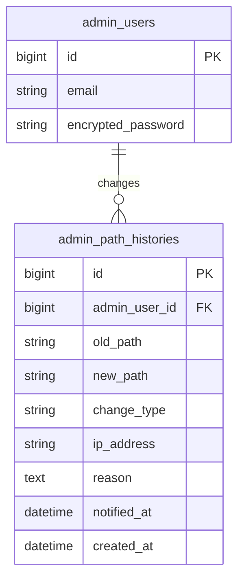

# Phase 7.2: 管理画面URL管理 - 設計書

## 📅 作成日: 2026-01-23
## 🎯 Phase: 7.2
## ⚡️ 優先度: 高
## 📊 ステータス: 設計完了

---

## 📋 目次

1. [アーキテクチャ設計](#アーキテクチャ設計)
2. [データベース設計](#データベース設計)
3. [API設計](#api設計)
4. [サービス設計](#サービス設計)
5. [UI/UX設計](#uiux設計)
6. [セキュリティ設計](#セキュリティ設計)
7. [テスト戦略](#テスト戦略)

---

## 🏗 アーキテクチャ設計

### システム構成図

```
┌─────────────────────────────────────────────────────────┐
│                  管理画面URL管理システム                  │
├─────────────────────────────────────────────────────────┤
│                                                           │
│  ┌──────────────────────────────────────────────────┐  │
│  │         Admin::AdminPathSettingsController        │  │
│  │  - edit: URL変更画面                              │  │
│  │  - update: URL変更実行                            │  │
│  │  - emergency_rotation: 緊急ローテーション         │  │
│  └──────────────────────────────────────────────────┘  │
│                          │                               │
│                          ▼                               │
│  ┌──────────────────────────────────────────────────┐  │
│  │           AdminPath::Updater Service              │  │
│  │  - validate!: バリデーション                      │  │
│  │  - update_env_file!: 環境変数更新                 │  │
│  │  - create_history!: 履歴記録                      │  │
│  │  - reload_routes!: ルーティング再読み込み         │  │
│  │  - send_notifications!: 通知送信                  │  │
│  └──────────────────────────────────────────────────┘  │
│                          │                               │
│                          ▼                               │
│  ┌──────────────────────────────────────────────────┐  │
│  │          AdminPath::RotationJob                   │  │
│  │  - perform: 自動ローテーション実行                │  │
│  │  - rotation_enabled?: ローテーション有効判定      │  │
│  │  - rotation_due?: ローテーション期限判定          │  │
│  └──────────────────────────────────────────────────┘  │
│                          │                               │
│                          ▼                               │
│  ┌──────────────────────────────────────────────────┐  │
│  │         AdminPathHistory Model                    │  │
│  │  - old_path, new_path, change_type                │  │
│  │  - admin_user, ip_address, reason                 │  │
│  └──────────────────────────────────────────────────┘  │
│                                                           │
└─────────────────────────────────────────────────────────┘
```

---

## 🗄 データベース設計

### AdminPathHistoryテーブル

```ruby
create_table :admin_path_histories do |t|
  t.string :old_path, null: false
  t.string :new_path, null: false
  t.string :change_type, null: false # manual, auto_rotation, emergency
  t.references :admin_user, null: false, foreign_key: true
  t.string :ip_address
  t.text :reason
  t.datetime :notified_at
  t.timestamps
end

add_index :admin_path_histories, :old_path
add_index :admin_path_histories, :new_path
add_index :admin_path_histories, :created_at
```

### ER図



---

## 🔌 API設計

### 内部API（管理画面用）

#### GET /admin/admin_path_settings/edit
```ruby
# URL変更画面表示
Response:
- @current_path: 現在のURL
- @histories: 変更履歴（最近10件）
- @rotation_enabled: ローテーション有効/無効
- @rotation_frequency: ローテーション頻度
- @next_rotation_at: 次回ローテーション日時
```

#### PUT /admin/admin_path_settings
```ruby
# URL変更実行
Request:
{
  "new_path": "new-admin-path-2026",
  "reason": "セキュリティ強化のため"
}

Response:
- flash[:notice]: 成功メッセージ
- redirect_to: edit_admin_admin_path_settings_path
```

#### POST /admin/admin_path_settings/emergency_rotation
```ruby
# 緊急ローテーション実行
Request:
{
  "reason": "不正アクセス検知"
}

Response:
- flash[:notice]: 成功メッセージ
- redirect_to: edit_admin_admin_path_settings_path
```

---

## 🔧 サービス設計

### AdminPath::Updater

```ruby
module AdminPath
  class Updater
    RESERVED_PATHS = %w[
      admin administrator root system api health
      login logout signin signout register signup
    ].freeze

    def initialize(admin_user:, new_path:, change_type: :manual, reason: nil)
      @admin_user = admin_user
      @new_path = new_path.to_s.strip.downcase
      @change_type = change_type
      @reason = reason
      @old_path = ENV.fetch('ADMIN_PATH', 'admin')
    end

    def call
      validate!
      update_env_file!
      create_history!
      reload_routes!
      send_notifications!
      
      { success: true, new_path: @new_path }
    rescue StandardError => e
      Rails.logger.error("AdminPath::Updater failed: #{e.message}")
      { success: false, error: e.message }
    end

    private

    def validate!
      raise ArgumentError, 'New path cannot be empty' if @new_path.blank?
      raise ArgumentError, 'New path is reserved' if RESERVED_PATHS.include?(@new_path)
      raise ArgumentError, 'New path must be alphanumeric with hyphens' unless @new_path.match?(/\A[a-z0-9\-]+\z/)
      raise ArgumentError, 'New path is same as current' if @new_path == @old_path
    end

    def update_env_file!
      # .env.production ファイルを更新
    end

    def create_history!
      # AdminPathHistory レコードを作成
    end

    def reload_routes!
      # ルーティングを再読み込み
    end

    def send_notifications!
      # メール・Slack通知を送信
    end
  end
end
```

---

## 🎨 UI/UX設計

### URL変更画面

#### レイアウト
- 現在のURL表示（大きく目立つように）
- URL変更フォーム
- 緊急ローテーションボタン（赤色）
- 自動ローテーション設定表示
- 変更履歴テーブル

#### フォーム要素
- 新しいURL入力欄（pattern: [a-z0-9\-]+）
- 変更理由入力欄（textarea、任意）
- 変更ボタン（確認ダイアログ付き）

#### 確認ダイアログ
- 「管理画面URLを変更しますか？変更後は新しいURLでアクセスしてください。」

---

## 🔒 セキュリティ設計

### URL形式制限
- 英小文字、数字、ハイフンのみ許可
- 正規表現: `/\A[a-z0-9\-]+\z/`

### 予約語チェック
```ruby
RESERVED_PATHS = %w[
  admin administrator root system api health
  login logout signin signout register signup
].freeze
```

### 変更履歴記録
- 全てのURL変更を記録
- 変更者、IPアドレス、変更理由を記録
- 削除不可（監査証跡）

---

## 🧪 テスト戦略

### RSpecテスト（15件目標）

#### モデルテスト（5件）
- AdminPathHistory
  - associations
  - validations
  - enums
  - scopes

#### サービステスト（5件）
- AdminPath::Updater
  - 正常系: URL変更成功
  - 異常系: 予約語エラー
  - 異常系: 形式エラー
  - 異常系: 同一URLエラー
  - 履歴記録確認

#### ジョブテスト（5件）
- AdminPath::RotationJob
  - ローテーション実行
  - ローテーション判定
  - ローテーション期限判定
  - URL生成
  - 通知送信

---

**📝 作成者**: Kiro（仕様管理担当）  
**📅 作成日**: 2026-01-23  
**🎯 Phase**: 7.2 管理画面URL管理  
**📋 ステータス**: 設計完了
