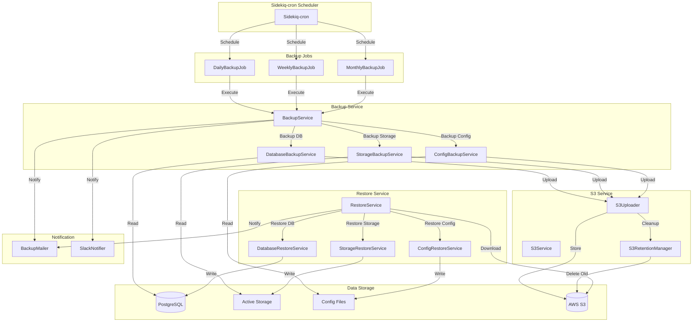

# Phase 7.3: 自動バックアップシステム - 設計書

## 📅 作成日: 2026-01-23
## 🎯 Phase: 7.3
## ⚡️ 優先度: 高
## 📊 ステータス: 設計中

---

## 📋 目次

1. [概要](#概要)
2. [アーキテクチャ](#アーキテクチャ)
3. [コンポーネントとインターフェース](#コンポーネントとインターフェース)
4. [データモデル](#データモデル)
5. [正確性プロパティ](#正確性プロパティ)
6. [エラーハンドリング](#エラーハンドリング)
7. [テスト戦略](#テスト戦略)
8. [AWS S3セットアップガイド](#aws-s3セットアップガイド)
9. [IAM認証情報作成ガイド](#iam認証情報作成ガイド)
10. [コスト見積もり](#コスト見積もり)

---

## 🎯 概要

Phase 7.3では、PostgreSQLデータベース、Active Storage、設定ファイルを自動的にバックアップし、AWS S3に暗号化して保存するシステムを実装します。Sidekiq-cronを使用して日次・週次・月次のスケジュールでバックアップを実行し、世代管理により適切な保存期間を維持します。

### 主要機能
- PostgreSQL全テーブルの自動バックアップ（pg_dump -Fc | gzip）
- Active Storage（storage/ディレクトリ）の自動バックアップ
- 設定ファイル（.env、credentials.yml.enc等）の自動バックアップ
- AWS S3への暗号化保存（SSE-S3、AES-256）
- 世代管理（日次7日、週次4週、月次12ヶ月）
- 管理画面からの復元機能
- バックアップ成功/失敗通知（Phase 7.8のBackupMailer使用）

### Phase 5.8との違い
- **Phase 5.8**: 特定モデルのみ、開発環境への移行用、手動実行、ローカル保存
- **Phase 7.3**: PostgreSQL全体、本番環境のバックアップ用、自動スケジュール、S3保存、暗号化、世代管理

---

## 🏗️ アーキテクチャ

### システム構成図



### レイヤー構成

1. **スケジューリング層**: Sidekiq-cronによる定期実行
2. **ジョブ層**: バックアップタイプ別のSidekiqジョブ
3. **サービス層**: バックアップ・復元ロジック
4. **ストレージ層**: AWS S3との連携
5. **通知層**: メール・Slack通知

---

## 🔧 コンポーネントとインターフェース

### 1. Sidekiq-cronスケジューラー

#### 設定ファイル: `config/initializers/sidekiq_cron.rb`

```ruby
if defined?(Sidekiq::Cron)
  Sidekiq::Cron::Job.load_from_hash(
    "daily_backup" => {
      "class" => "Backup::DailyBackupJob",
      "cron" => "0 3 * * *",  # 毎日午前3時（JST）
      "queue" => "backup",
      "description" => "日次バックアップ"
    },
    "weekly_backup" => {
      "class" => "Backup::WeeklyBackupJob",
      "cron" => "0 3 * * 0",  # 毎週日曜日午前3時（JST）
      "queue" => "backup",
      "description" => "週次バックアップ"
    },
    "monthly_backup" => {
      "class" => "Backup::MonthlyBackupJob",
      "cron" => "0 3 1 * *",  # 毎月1日午前3時（JST）
      "queue" => "backup",
      "description" => "月次バックアップ"
    }
  )
end
```

### 2. バックアップジョブ

#### `app/jobs/backup/daily_backup_job.rb`

```ruby
module Backup
  class DailyBackupJob < ApplicationJob
    queue_as :backup
    
    def perform
      BackupService.new(backup_type: "daily").execute
    end
  end
end
```

#### `app/jobs/backup/weekly_backup_job.rb`

```ruby
module Backup
  class WeeklyBackupJob < ApplicationJob
    queue_as :backup
    
    def perform
      BackupService.new(backup_type: "weekly").execute
    end
  end
end
```

#### `app/jobs/backup/monthly_backup_job.rb`

```ruby
module Backup
  class MonthlyBackupJob < ApplicationJob
    queue_as :backup
    
    def perform
      BackupService.new(backup_type: "monthly").execute
    end
  end
end
```

### 3. バックアップサービス

#### `app/services/backup_service.rb`

```ruby
class BackupService
  attr_reader :backup_type, :backup_log
  
  def initialize(backup_type:)
    @backup_type = backup_type
    @backup_log = BackupLog.create!(
      backup_type: backup_type,
      status: "in_progress",
      started_at: Time.current
    )
  end
  
  def execute
    database_file = backup_database
    storage_file = backup_storage
    config_file = backup_config
    
    upload_to_s3(database_file, "database")
    upload_to_s3(storage_file, "storage")
    upload_to_s3(config_file, "config")
    
    cleanup_old_backups
    mark_success
    notify_success
  rescue => e
    mark_failure(e)
    notify_failure(e)
    raise
  ensure
    cleanup_temp_files([database_file, storage_file, config_file])
  end
  
  private
  
  def backup_database
    DatabaseBackupService.new(backup_type).execute
  end
  
  def backup_storage
    StorageBackupService.new(backup_type).execute
  end
  
  def backup_config
    ConfigBackupService.new(backup_type).execute
  end
  
  def upload_to_s3(file_path, category)
    return unless file_path && File.exist?(file_path)
    
    S3Service.new.upload(
      file_path: file_path,
      backup_type: backup_type,
      category: category
    )
  end
  
  def cleanup_old_backups
    S3RetentionManager.new(backup_type).cleanup
  end
  
  def mark_success
    backup_log.update!(
      status: "success",
      completed_at: Time.current,
      file_size: calculate_total_size
    )
  end
  
  def mark_failure(error)
    backup_log.update!(
      status: "failed",
      completed_at: Time.current,
      error_message: error.message
    )
  end
  
  def notify_success
    BackupMailer.backup_success(backup_log).deliver_later
    SlackNotifier.notify_backup_status(
      backup_type: backup_type,
      status: "success",
      details: backup_log
    )
  end
  
  def notify_failure(error)
    BackupMailer.backup_failed(backup_log, error).deliver_later
    SlackNotifier.notify_backup_status(
      backup_type: backup_type,
      status: "failed",
      error: error.message
    )
  end
  
  def cleanup_temp_files(files)
    files.compact.each do |file|
      File.delete(file) if File.exist?(file)
    end
  end
  
  def calculate_total_size
    # S3から最新のバックアップファイルサイズを取得
    S3Service.new.get_latest_backup_size(backup_type)
  end
end
```

### 4. データベースバックアップサービス

#### `app/services/database_backup_service.rb`

```ruby
class DatabaseBackupService
  attr_reader :backup_type, :timestamp
  
  def initialize(backup_type)
    @backup_type = backup_type
    @timestamp = Time.current.strftime("%Y%m%d_%H%M%S")
  end
  
  def execute
    dump_file = create_dump
    compressed_file = compress_dump(dump_file)
    verify_checksum(compressed_file)
    compressed_file
  end
  
  private
  
  def create_dump
    dump_file = temp_file_path("database", "dump")
    
    db_config = ActiveRecord::Base.connection_db_config.configuration_hash
    
    command = [
      "pg_dump",
      "-h", db_config[:host] || "localhost",
      "-U", db_config[:username],
      "-d", db_config[:database],
      "-Fc",  # Custom format (compressed)
      "-f", dump_file
    ]
    
    env = { "PGPASSWORD" => db_config[:password] }
    
    system(env, *command)
    
    unless $?.success?
      raise "Database dump failed with exit code #{$?.exitstatus}"
    end
    
    dump_file
  end
  
  def compress_dump(dump_file)
    compressed_file = "#{dump_file}.gz"
    
    system("gzip", "-c", dump_file, out: compressed_file)
    
    unless $?.success?
      raise "Compression failed with exit code #{$?.exitstatus}"
    end
    
    File.delete(dump_file)
    compressed_file
  end
  
  def verify_checksum(file)
    checksum = Digest::SHA256.file(file).hexdigest
    Rails.logger.info("Database backup checksum: #{checksum}")
    checksum
  end
  
  def temp_file_path(category, extension)
    Rails.root.join("tmp", "backup", "#{category}_#{timestamp}_#{backup_type}.#{extension}").to_s
  end
end
```

### 5. Active Storageバックアップサービス

#### `app/services/storage_backup_service.rb`

```ruby
class StorageBackupService
  attr_reader :backup_type, :timestamp
  
  def initialize(backup_type)
    @backup_type = backup_type
    @timestamp = Time.current.strftime("%Y%m%d_%H%M%S")
  end
  
  def execute
    storage_dir = Rails.root.join("storage")
    
    unless Dir.exist?(storage_dir)
      Rails.logger.warn("Storage directory does not exist, creating empty archive")
      FileUtils.mkdir_p(storage_dir)
    end
    
    archive_file = create_archive(storage_dir)
    verify_checksum(archive_file)
    archive_file
  end
  
  private
  
  def create_archive(storage_dir)
    archive_file = temp_file_path("storage", "tar.gz")
    
    system("tar", "-czf", archive_file, "-C", Rails.root.to_s, "storage")
    
    unless $?.success?
      raise "Storage archive failed with exit code #{$?.exitstatus}"
    end
    
    archive_file
  end
  
  def verify_checksum(file)
    checksum = Digest::SHA256.file(file).hexdigest
    Rails.logger.info("Storage backup checksum: #{checksum}")
    checksum
  end
  
  def temp_file_path(category, extension)
    Rails.root.join("tmp", "backup", "#{category}_#{timestamp}_#{backup_type}.#{extension}").to_s
  end
end
```

### 6. 設定ファイルバックアップサービス

#### `app/services/config_backup_service.rb`

```ruby
class ConfigBackupService
  attr_reader :backup_type, :timestamp
  
  REQUIRED_FILES = [
    ".env",
    "config/credentials.yml.enc"
  ].freeze
  
  OPTIONAL_FILES = [
    ".env.production",
    "config/master.key"
  ].freeze
  
  def initialize(backup_type)
    @backup_type = backup_type
    @timestamp = Time.current.strftime("%Y%m%d_%H%M%S")
  end
  
  def execute
    validate_required_files
    archive_file = create_archive
    verify_checksum(archive_file)
    archive_file
  end
  
  private
  
  def validate_required_files
    missing_files = REQUIRED_FILES.reject { |file| File.exist?(Rails.root.join(file)) }
    
    if missing_files.any?
      raise "Required config files missing: #{missing_files.join(', ')}"
    end
  end
  
  def create_archive
    archive_file = temp_file_path("config", "tar.gz")
    temp_dir = Rails.root.join("tmp", "backup", "config_#{timestamp}")
    
    FileUtils.mkdir_p(temp_dir)
    
    # Copy files to temp directory
    (REQUIRED_FILES + OPTIONAL_FILES).each do |file|
      source = Rails.root.join(file)
      next unless File.exist?(source)
      
      dest = temp_dir.join(File.basename(file))
      FileUtils.cp(source, dest)
    end
    
    # Create archive
    system("tar", "-czf", archive_file, "-C", temp_dir.to_s, ".")
    
    unless $?.success?
      raise "Config archive failed with exit code #{$?.exitstatus}"
    end
    
    # Cleanup temp directory
    FileUtils.rm_rf(temp_dir)
    
    archive_file
  end
  
  def verify_checksum(file)
    checksum = Digest::SHA256.file(file).hexdigest
    Rails.logger.info("Config backup checksum: #{checksum}")
    checksum
  end
  
  def temp_file_path(category, extension)
    Rails.root.join("tmp", "backup", "#{category}_#{timestamp}_#{backup_type}.#{extension}").to_s
  end
end
```

### 7. S3サービス

#### `app/services/s3_service.rb`

```ruby
require "aws-sdk-s3"

class S3Service
  attr_reader :client, :bucket_name
  
  def initialize
    @client = Aws::S3::Client.new(
      region: ENV.fetch("AWS_REGION", "ap-northeast-1"),
      access_key_id: ENV.fetch("AWS_ACCESS_KEY_ID"),
      secret_access_key: ENV.fetch("AWS_SECRET_ACCESS_KEY")
    )
    @bucket_name = ENV.fetch("S3_BACKUP_BUCKET", "portfolio-backup-miyakawa2449")
  end
  
  def upload(file_path:, backup_type:, category:)
    file_name = File.basename(file_path)
    timestamp = Time.current
    
    # S3 object key: backup_type/YYYY/MM/DD/category_filename
    object_key = [
      backup_type,
      timestamp.strftime("%Y"),
      timestamp.strftime("%m"),
      timestamp.strftime("%d"),
      "#{category}_#{file_name}"
    ].join("/")
    
    File.open(file_path, "rb") do |file|
      client.put_object(
        bucket: bucket_name,
        key: object_key,
        body: file,
        server_side_encryption: "AES256",  # SSE-S3
        metadata: {
          "backup-type" => backup_type,
          "category" => category,
          "timestamp" => timestamp.iso8601,
          "checksum" => Digest::SHA256.file(file_path).hexdigest
        }
      )
    end
    
    Rails.logger.info("Uploaded to S3: #{object_key}")
    object_key
  end
  
  def list_backups(backup_type: nil, category: nil)
    prefix = backup_type ? "#{backup_type}/" : ""
    
    response = client.list_objects_v2(
      bucket: bucket_name,
      prefix: prefix
    )
    
    objects = response.contents.map do |obj|
      {
        key: obj.key,
        size: obj.size,
        last_modified: obj.last_modified,
        etag: obj.etag
      }
    end
    
    if category
      objects.select { |obj| obj[:key].include?("/#{category}_") }
    else
      objects
    end
  end
  
  def download(object_key:, destination:)
    client.get_object(
      bucket: bucket_name,
      key: object_key,
      response_target: destination
    )
    
    Rails.logger.info("Downloaded from S3: #{object_key}")
  end
  
  def delete(object_key:)
    client.delete_object(
      bucket: bucket_name,
      key: object_key
    )
    
    Rails.logger.info("Deleted from S3: #{object_key}")
  end
  
  def get_latest_backup_size(backup_type)
    backups = list_backups(backup_type: backup_type)
    backups.sum { |obj| obj[:size] }
  end
end
```

### 8. S3世代管理サービス

#### `app/services/s3_retention_manager.rb`

```ruby
class S3RetentionManager
  RETENTION_DAYS = {
    "daily" => 7,
    "weekly" => 28,  # 4 weeks
    "monthly" => 365  # 12 months
  }.freeze
  
  attr_reader :backup_type, :s3_service
  
  def initialize(backup_type)
    @backup_type = backup_type
    @s3_service = S3Service.new
  end
  
  def cleanup
    retention_days = RETENTION_DAYS[backup_type]
    cutoff_date = retention_days.days.ago
    
    old_backups = find_old_backups(cutoff_date)
    
    old_backups.each do |backup|
      s3_service.delete(object_key: backup[:key])
      Rails.logger.info("Deleted old backup: #{backup[:key]}")
    end
    
    Rails.logger.info("Cleanup completed: #{old_backups.size} backups deleted")
  end
  
  private
  
  def find_old_backups(cutoff_date)
    all_backups = s3_service.list_backups(backup_type: backup_type)
    
    all_backups.select do |backup|
      backup[:last_modified] < cutoff_date
    end
  end
end
```

### 9. 復元サービス

#### `app/services/restore_service.rb`

```ruby
class RestoreService
  attr_reader :backup_keys, :backup_log
  
  def initialize(backup_keys:)
    @backup_keys = backup_keys  # { database: "key", storage: "key", config: "key" }
    @backup_log = BackupLog.create!(
      backup_type: "restore",
      status: "in_progress",
      started_at: Time.current
    )
  end
  
  def execute
    database_file = download_from_s3(backup_keys[:database])
    storage_file = download_from_s3(backup_keys[:storage])
    config_file = download_from_s3(backup_keys[:config])
    
    restore_database(database_file) if database_file
    restore_storage(storage_file) if storage_file
    restore_config(config_file) if config_file
    
    mark_success
    notify_success
  rescue => e
    mark_failure(e)
    notify_failure(e)
    raise
  ensure
    cleanup_temp_files([database_file, storage_file, config_file])
  end
  
  private
  
  def download_from_s3(object_key)
    return nil unless object_key
    
    temp_file = Rails.root.join("tmp", "restore", File.basename(object_key)).to_s
    FileUtils.mkdir_p(File.dirname(temp_file))
    
    S3Service.new.download(object_key: object_key, destination: temp_file)
    temp_file
  end
  
  def restore_database(file_path)
    DatabaseRestoreService.new(file_path).execute
  end
  
  def restore_storage(file_path)
    StorageRestoreService.new(file_path).execute
  end
  
  def restore_config(file_path)
    ConfigRestoreService.new(file_path).execute
  end
  
  def mark_success
    backup_log.update!(
      status: "success",
      completed_at: Time.current
    )
  end
  
  def mark_failure(error)
    backup_log.update!(
      status: "failed",
      completed_at: Time.current,
      error_message: error.message
    )
  end
  
  def notify_success
    BackupMailer.restore_success(backup_log).deliver_later
  end
  
  def notify_failure(error)
    BackupMailer.restore_failed(backup_log, error).deliver_later
  end
  
  def cleanup_temp_files(files)
    files.compact.each do |file|
      File.delete(file) if File.exist?(file)
    end
  end
end
```

---

## 📊 データモデル

### BackupLogモデル

```ruby
# app/models/backup_log.rb
class BackupLog < ApplicationRecord
  # Enums
  enum :backup_type, {
    daily: 0,
    weekly: 1,
    monthly: 2,
    restore: 3
  }
  
  enum :status, {
    in_progress: 0,
    success: 1,
    failed: 2
  }
  
  # Validations
  validates :backup_type, presence: true
  validates :status, presence: true
  validates :started_at, presence: true
  
  # Scopes
  scope :recent, -> { order(started_at: :desc) }
  scope :successful, -> { where(status: :success) }
  scope :failed, -> { where(status: :failed) }
  scope :by_type, ->(type) { where(backup_type: type) }
  
  # Instance methods
  def duration
    return nil unless completed_at
    completed_at - started_at
  end
  
  def file_size_mb
    return nil unless file_size
    (file_size.to_f / 1024 / 1024).round(2)
  end
end
```

### マイグレーション

```ruby
# db/migrate/YYYYMMDDHHMMSS_create_backup_logs.rb
class CreateBackupLogs < ActiveRecord::Migration[8.1]
  def change
    create_table :backup_logs do |t|
      t.integer :backup_type, null: false, default: 0
      t.integer :status, null: false, default: 0
      t.datetime :started_at, null: false
      t.datetime :completed_at
      t.bigint :file_size
      t.text :error_message
      t.string :s3_keys, array: true, default: []
      
      t.timestamps
    end
    
    add_index :backup_logs, :backup_type
    add_index :backup_logs, :status
    add_index :backup_logs, :started_at
  end
end
```

---

## ✅ 正確性プロパティ

*プロパティとは、システムの全ての有効な実行において真であるべき特性や振る舞いのことです。プロパティは、人間が読める仕様と機械が検証可能な正確性保証の橋渡しをします。*

### バックアップ生成プロパティ

**Property 1: データベース完全性**
*For any* データベース状態、pg_dumpで生成されたバックアップファイルには、全スキーマ、全テーブル（active_storage_blobs、active_storage_attachments、active_storage_variant_recordsを含む）、全インデックス、全シーケンス、全制約が含まれるべきである
**Validates: Requirements 1.1, 1.2, 1.3**

**Property 2: バックアップファイル形式**
*For any* バックアップファイル（database、storage、config）、ファイル名は`{category}_{YYYYMMDD}_{HHMMSS}_{backup_type}.{extension}`の形式に従い、適切に圧縮（gzip）されているべきである
**Validates: Requirements 1.4, 1.5, 2.1, 2.2, 3.5, 3.6**

**Property 3: バックアップメタデータ記録**
*For any* 成功したバックアップ、BackupLogにはファイルサイズ、チェックサム、started_at、completed_atが記録されるべきである
**Validates: Requirements 1.6, 1.7, 2.3, 5.5**

**Property 4: 設定ファイル完全性**
*For any* 設定ファイルバックアップ、必須ファイル（.env、config/credentials.yml.enc）が全て含まれ、存在するオプションファイル（.env.production、config/master.key）も含まれるべきである
**Validates: Requirements 3.1, 3.2, 3.3, 3.4**

### S3アップロードプロパティ

**Property 5: S3暗号化アップロード**
*For any* S3にアップロードされたバックアップファイル、サーバーサイド暗号化（SSE-S3、AES-256）が有効であり、オブジェクトキーは`{backup_type}/{YYYY}/{MM}/{DD}/{category}_{filename}`の形式に従うべきである
**Validates: Requirements 4.1, 4.2, 4.3**

**Property 6: 一時ファイルクリーンアップ**
*For any* S3アップロード完了後、ローカルの一時ファイルは削除されるべきである
**Validates: Requirements 4.4**

**Property 7: S3アップロードリトライ**
*For any* S3アップロード失敗、最大3回リトライされ、3回失敗後はエラーログとBackup_Mailerによる失敗通知が送信されるべきである
**Validates: Requirements 4.5, 4.6**

### 世代管理プロパティ

**Property 8: バックアップ保持期間**
*For any* バックアップタイプ（daily: 7日、weekly: 28日、monthly: 365日）、保持期間を超えた古いバックアップはS3から削除され、削除ログが記録されるべきである
**Validates: Requirements 6.1, 6.2, 6.3, 6.4**

**Property 9: 世代管理エラー耐性**
*For any* 世代管理の削除処理失敗、エラーログが記録されるが、バックアップ処理は継続されるべきである
**Validates: Requirements 6.5**

### 通知プロパティ

**Property 10: バックアップ成功通知**
*For any* 成功したバックアップ、Backup_Mailerのbackup_successメソッドとSlack_Notifierのnotify_backup_statusメソッドが呼び出され、バックアップタイプ、日時、ファイルサイズが含まれるべきである
**Validates: Requirements 7.1, 7.3, 7.4**

**Property 11: バックアップ失敗通知**
*For any* 失敗したバックアップ、Backup_Mailerのbackup_failedメソッドが呼び出され、エラーメッセージが含まれるべきである
**Validates: Requirements 7.2**

**Property 12: 通知エラー耐性**
*For any* メール送信失敗、エラーログが記録されるが、バックアップ処理は継続されるべきである
**Validates: Requirements 7.5**

### 復元プロパティ

**Property 13: データベース復元ラウンドトリップ**
*For any* データベース状態、バックアップしてから復元すると、元のデータベース状態と等価なデータベース状態が得られるべきである（ラウンドトリッププロパティ）
**Validates: Requirements 9.2, 9.3**

**Property 14: Active Storage復元ラウンドトリップ**
*For any* storage/ディレクトリの状態、バックアップしてから復元すると、元のディレクトリ構造とファイル内容が得られるべきである（ラウンドトリッププロパティ）
**Validates: Requirements 9.2, 9.4**

**Property 15: 設定ファイル復元ラウンドトリップ**
*For any* 設定ファイルセット、バックアップしてから復元すると、元のファイル内容が得られるべきである（ラウンドトリッププロパティ）
**Validates: Requirements 9.2, 9.5**

**Property 16: 復元ログ記録**
*For any* 復元操作、BackupLogに復元ログが記録され、成功時はBackup_Mailerのrestore_successメソッドが、失敗時はrestore_failedメソッドが呼び出されるべきである
**Validates: Requirements 9.6, 9.7, 9.8**

**Property 17: 復元バックグラウンド実行**
*For any* 復元操作、Sidekiqバックグラウンドジョブとして実行されるべきである
**Validates: Requirements 9.9**

### バックアップ一覧プロパティ

**Property 18: バックアップ一覧ソート**
*For any* バックアップ一覧、最新のバックアップが上部に表示され（日時降順）、各バックアップには日時、タイプ、ファイルサイズが含まれるべきである
**Validates: Requirements 8.2, 8.3**

**Property 19: バックアップフィルタリング**
*For any* バックアップタイプフィルター、フィルタリング後のリストには指定されたタイプのバックアップのみが含まれるべきである
**Validates: Requirements 8.4**

### エラーハンドリングプロパティ

**Property 20: データベース接続エラー**
*For any* データベース接続失敗、エラーログが記録され、Backup_Mailerで失敗通知が送信されるべきである
**Validates: Requirements 1.8**

**Property 21: 必須設定ファイル欠落エラー**
*For any* 必須設定ファイル（.env、credentials.yml.enc）の欠落、エラーログが記録され、Backup_Mailerで失敗通知が送信されるべきである
**Validates: Requirements 3.7**

**Property 22: S3リスト取得エラー**
*For any* S3からのバックアップリスト取得失敗、エラーメッセージが表示されるべきである
**Validates: Requirements 8.5**

---

## 🚨 エラーハンドリング

### エラー分類

#### 1. 致命的エラー（バックアップ中止）
- データベース接続失敗
- 必須設定ファイル欠落
- S3アップロード失敗（3回リトライ後）
- ディスク容量不足

#### 2. 警告エラー（バックアップ継続）
- オプション設定ファイル欠落
- storage/ディレクトリ不在
- 世代管理の削除失敗
- メール送信失敗

### エラーハンドリング戦略

```ruby
# 致命的エラーの例
begin
  database_file = backup_database
rescue DatabaseConnectionError => e
  mark_failure(e)
  notify_failure(e)
  raise  # バックアップ中止
end

# 警告エラーの例
begin
  cleanup_old_backups
rescue S3DeletionError => e
  Rails.logger.warn("Cleanup failed: #{e.message}")
  # バックアップ処理は継続
end
```

### リトライ戦略

```ruby
# S3アップロードのリトライ
def upload_with_retry(file_path, max_retries: 3)
  retries = 0
  
  begin
    s3_service.upload(file_path)
  rescue Aws::S3::Errors::ServiceError => e
    retries += 1
    
    if retries < max_retries
      Rails.logger.warn("S3 upload failed (attempt #{retries}/#{max_retries}): #{e.message}")
      sleep(2 ** retries)  # Exponential backoff
      retry
    else
      Rails.logger.error("S3 upload failed after #{max_retries} attempts")
      raise
    end
  end
end
```

---

## 🧪 テスト戦略

### デュアルテストアプローチ

Phase 7.3では、ユニットテストとプロパティベーステストの両方を使用します：

- **ユニットテスト**: 特定の例、エッジケース、エラー条件を検証
- **プロパティテスト**: 全ての入力に対する普遍的なプロパティを検証

### プロパティベーステスト設定

- **テストライブラリ**: RSpec + rspec-parameterized
- **最小イテレーション数**: 100回（ランダム化のため）
- **タグ形式**: `# Feature: phase-7.3-auto-backup, Property {number}: {property_text}`

### テストカバレッジ目標

- **全体カバレッジ**: 85%以上
- **サービス層**: 90%以上
- **ジョブ層**: 80%以上
- **モデル層**: 95%以上

### テスト例

#### ユニットテスト例

```ruby
# spec/services/database_backup_service_spec.rb
RSpec.describe DatabaseBackupService do
  describe "#execute" do
    it "creates a compressed database dump" do
      service = described_class.new("daily")
      file = service.execute
      
      expect(File.exist?(file)).to be true
      expect(file).to end_with(".dump.gz")
    end
    
    it "raises error when database connection fails" do
      allow(ActiveRecord::Base).to receive(:connection_db_config).and_raise(ActiveRecord::ConnectionNotEstablished)
      
      service = described_class.new("daily")
      expect { service.execute }.to raise_error(DatabaseConnectionError)
    end
  end
end
```

#### プロパティテスト例

```ruby
# spec/services/backup_service_property_spec.rb
# Feature: phase-7.3-auto-backup, Property 2: バックアップファイル形式
RSpec.describe BackupService, :property do
  describe "Property 2: Backup file format" do
    let(:backup_types) { %w[daily weekly monthly] }
    let(:categories) { %w[database storage config] }
    
    it "generates files with correct naming format" do
      100.times do
        backup_type = backup_types.sample
        category = categories.sample
        
        service = described_class.new(backup_type: backup_type)
        file = service.send("backup_#{category}")
        
        # Verify format: {category}_{YYYYMMDD}_{HHMMSS}_{backup_type}.{extension}
        expect(File.basename(file)).to match(
          /^#{category}_\d{8}_\d{6}_#{backup_type}\.(dump\.gz|tar\.gz)$/
        )
      end
    end
  end
end
```

### テスト実装タスク

1. **BackupServiceのテスト** (10件)
   - バックアップ実行の成功ケース
   - エラーハンドリング
   - 通知送信

2. **DatabaseBackupServiceのテスト** (8件)
   - pg_dump実行
   - 圧縮処理
   - チェックサム検証

3. **StorageBackupServiceのテスト** (6件)
   - tar.gz作成
   - 空ディレクトリ処理

4. **ConfigBackupServiceのテスト** (8件)
   - 必須ファイル検証
   - オプションファイル処理
   - アーカイブ作成

5. **S3Serviceのテスト** (12件)
   - アップロード
   - ダウンロード
   - リスト取得
   - 削除

6. **S3RetentionManagerのテスト** (6件)
   - 世代管理
   - 削除処理

7. **RestoreServiceのテスト** (10件)
   - 復元処理
   - ラウンドトリップ
   - エラーハンドリング

8. **BackupLogモデルのテスト** (5件)
   - バリデーション
   - スコープ
   - メソッド

9. **プロパティテスト** (22件)
   - 全22プロパティの検証

**合計**: 87件以上のテスト

---

## 📚 AWS S3セットアップガイド

### 前提条件

- AWSアカウント
- AWS Management Consoleへのアクセス権限
- S3バケット作成権限

### ステップ1: S3バケット作成

1. **AWS Management Consoleにログイン**
   - https://console.aws.amazon.com/

2. **S3サービスに移動**
   - サービス検索で「S3」を検索
   - 「S3」をクリック

3. **バケットを作成**
   - 「バケットを作成」ボタンをクリック
   - バケット名: `portfolio-backup-miyakawa2449`
   - リージョン: `アジアパシフィック（東京）ap-northeast-1`
   - 「バケットを作成」をクリック

### ステップ2: サーバーサイド暗号化（SSE-S3）の有効化

1. **作成したバケットを選択**
   - バケット一覧から`portfolio-backup-miyakawa2449`をクリック

2. **プロパティタブに移動**
   - 「プロパティ」タブをクリック

3. **デフォルトの暗号化を設定**
   - 「デフォルトの暗号化」セクションで「編集」をクリック
   - 「サーバー側の暗号化」を有効化
   - 暗号化タイプ: `Amazon S3 マネージドキー（SSE-S3）`
   - 「変更を保存」をクリック

### ステップ3: パブリックアクセスブロック設定

1. **アクセス許可タブに移動**
   - 「アクセス許可」タブをクリック

2. **パブリックアクセスをブロック**
   - 「パブリックアクセスをブロック」セクションで「編集」をクリック
   - 全てのオプションにチェックを入れる:
     - ✅ 新しいアクセスコントロールリスト（ACL）を介して付与されたバケットとオブジェクトへのパブリックアクセスをブロックする
     - ✅ 任意のアクセスコントロールリスト（ACL）を介して付与されたバケットとオブジェクトへのパブリックアクセスをブロックする
     - ✅ 新しいパブリックバケットポリシーまたはアクセスポイントポリシーを介して付与されたバケットとオブジェクトへのパブリックアクセスをブロックする
     - ✅ 任意のパブリックバケットポリシーまたはアクセスポイントポリシーを介したバケットとオブジェクトへのパブリックアクセスとクロスアカウントアクセスをブロックする
   - 「変更を保存」をクリック

### ステップ4: バージョニング設定

1. **プロパティタブに移動**
   - 「プロパティ」タブをクリック

2. **バージョニングを有効化**
   - 「バージョニング」セクションで「編集」をクリック
   - 「有効にする」を選択
   - 「変更を保存」をクリック

### ステップ5: ライフサイクルルール設定（オプション）

S3のライフサイクルルールを使用して、自動的に古いバックアップを削除することもできます。ただし、Phase 7.3ではS3RetentionManagerで世代管理を実装しているため、このステップはオプションです。

1. **管理タブに移動**
   - 「管理」タブをクリック

2. **ライフサイクルルールを作成**
   - 「ライフサイクルルールを作成」をクリック
   - ルール名: `daily-backup-retention`
   - ルールスコープ: `プレフィックスを使用してオブジェクトを制限する`
   - プレフィックス: `daily/`
   - ライフサイクルルールアクション: `オブジェクトの現在のバージョンを期限切れにする`
   - 日数: `7`
   - 「ルールを作成」をクリック

3. **週次・月次バックアップのルールも同様に作成**
   - 週次: プレフィックス `weekly/`、日数 `28`
   - 月次: プレフィックス `monthly/`、日数 `365`

---

## 🔐 IAM認証情報作成ガイド

### ステップ1: IAMユーザー作成

1. **IAMサービスに移動**
   - AWS Management Consoleで「IAM」を検索
   - 「IAM」をクリック

2. **ユーザーを作成**
   - 左メニューから「ユーザー」をクリック
   - 「ユーザーを作成」ボタンをクリック
   - ユーザー名: `portfolio-backup-user`
   - 「次へ」をクリック

### ステップ2: S3アクセス権限設定（最小権限の原則）

1. **ポリシーをアタッチ**
   - 「ポリシーを直接アタッチする」を選択
   - 「ポリシーを作成」をクリック

2. **カスタムポリシーを作成**
   - JSON タブをクリック
   - 以下のポリシーを貼り付け:

```json
{
  "Version": "2012-10-17",
  "Statement": [
    {
      "Sid": "BackupS3Access",
      "Effect": "Allow",
      "Action": [
        "s3:PutObject",
        "s3:GetObject",
        "s3:DeleteObject",
        "s3:ListBucket"
      ],
      "Resource": [
        "arn:aws:s3:::portfolio-backup-miyakawa2449",
        "arn:aws:s3:::portfolio-backup-miyakawa2449/*"
      ]
    }
  ]
}
```

3. **ポリシーに名前を付けて作成**
   - ポリシー名: `PortfolioBackupS3Policy`
   - 「ポリシーを作成」をクリック

4. **ユーザーにポリシーをアタッチ**
   - ユーザー作成画面に戻る
   - 作成した`PortfolioBackupS3Policy`を検索して選択
   - 「次へ」をクリック
   - 「ユーザーを作成」をクリック

### ステップ3: アクセスキー発行

1. **作成したユーザーを選択**
   - ユーザー一覧から`portfolio-backup-user`をクリック

2. **アクセスキーを作成**
   - 「セキュリティ認証情報」タブをクリック
   - 「アクセスキーを作成」をクリック
   - ユースケース: `サードパーティサービス`
   - 確認チェックボックスにチェック
   - 「次へ」をクリック

3. **アクセスキーをダウンロード**
   - 「アクセスキーを作成」をクリック
   - **重要**: アクセスキーIDとシークレットアクセスキーをメモまたはダウンロード
   - このページを閉じると、シークレットアクセスキーは二度と表示されません

### ステップ4: 環境変数設定

1. **.envファイルに追加**

```bash
# AWS S3 Backup Configuration
AWS_ACCESS_KEY_ID=your_access_key_id_here
AWS_SECRET_ACCESS_KEY=your_secret_access_key_here
AWS_REGION=ap-northeast-1
S3_BACKUP_BUCKET=portfolio-backup-miyakawa2449
```

2. **.env.productionファイルにも追加**

本番環境用の`.env.production`ファイルにも同じ設定を追加してください。

3. **環境変数の安全な管理**
   - `.env`ファイルは`.gitignore`に含める（既に含まれているはず）
   - 本番環境では、環境変数を直接サーバーに設定するか、AWS Secrets Managerを使用
   - アクセスキーは定期的にローテーション（90日ごと推奨）

---

## 💰 コスト見積もり

### S3ストレージコスト

**前提条件**:
- データベースサイズ: 100MB（圧縮後）
- Active Storageサイズ: 500MB（圧縮後）
- 設定ファイルサイズ: 1MB（圧縮後）
- 合計バックアップサイズ: 601MB

**世代管理**:
- 日次バックアップ: 7世代 × 601MB = 4.2GB
- 週次バックアップ: 4世代 × 601MB = 2.4GB
- 月次バックアップ: 12世代 × 601MB = 7.2GB
- **合計ストレージ**: 13.8GB

**S3ストレージ料金（ap-northeast-1）**:
- 最初の50TB: $0.025/GB/月
- 13.8GB × $0.025 = **$0.35/月**

### データ転送コスト

**アップロード**:
- S3へのアップロード: 無料

**ダウンロード**:
- 月1回の復元テスト: 601MB
- 最初の100GB: $0.114/GB
- 0.601GB × $0.114 = **$0.07/月**

### リクエストコスト

**PUTリクエスト**:
- 日次: 3ファイル × 30日 = 90リクエスト
- 週次: 3ファイル × 4回 = 12リクエスト
- 月次: 3ファイル × 1回 = 3リクエスト
- 合計: 105リクエスト/月
- $0.0047/1000リクエスト
- 105 × $0.0047 / 1000 = **$0.0005/月**

**GETリクエスト**:
- リスト取得: 30回/月
- ダウンロード: 3回/月
- 合計: 33リクエスト/月
- $0.00037/1000リクエスト
- 33 × $0.00037 / 1000 = **$0.00001/月**

### 月額合計

| 項目 | 月額コスト |
|------|-----------|
| ストレージ | $0.35 |
| データ転送 | $0.07 |
| リクエスト | $0.001 |
| **合計** | **$0.42/月** |

**日本円換算**（1ドル=150円）: **約63円/月**

### コスト最適化のヒント

1. **ストレージクラスの活用**
   - 月次バックアップは`S3 Glacier`に移行（$0.005/GB/月）
   - 年間コスト削減: 約$2.16

2. **圧縮率の向上**
   - データベースダンプの圧縮レベルを調整
   - 画像ファイルの最適化

3. **世代管理の最適化**
   - 日次バックアップを5日に短縮
   - 週次バックアップを3週に短縮

4. **リージョンの選択**
   - 東京リージョン（ap-northeast-1）は他リージョンより若干高い
   - ただし、レイテンシーを考慮すると東京が最適

---

**📝 作成者**: Kiro（仕様管理担当）  
**📅 作成日**: 2026-01-23  
**🔄 バージョン**: v1.0  
**📋 ステータス**: 設計中
