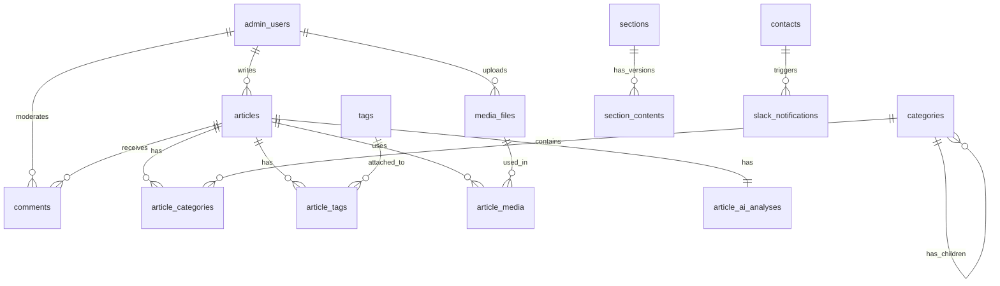

# データベーススキーマ設計書

## 概要
ポートフォリオサイトのデータベース設計。PostgreSQLを使用し、日本語全文検索、階層カテゴリ、メディア管理、AI連携機能を実装。

## ER図概要



## テーブル定義

### 1. admin_users（管理ユーザー）

```sql
CREATE TABLE admin_users (
    id BIGSERIAL PRIMARY KEY,
    email VARCHAR(255) NOT NULL UNIQUE,
    encrypted_password VARCHAR(255) NOT NULL,
    name VARCHAR(100) NOT NULL,
    avatar_url VARCHAR(500),
    role VARCHAR(50) DEFAULT 'author', -- admin, editor, author, viewer
    
    -- 認証関連
    remember_created_at TIMESTAMP,
    sign_in_count INTEGER DEFAULT 0,
    current_sign_in_at TIMESTAMP,
    last_sign_in_at TIMESTAMP,
    current_sign_in_ip INET,
    last_sign_in_ip INET,
    
    -- 2FA設定
    otp_secret VARCHAR(255),
    otp_required_for_login BOOLEAN DEFAULT false,
    
    -- アクセス制御
    failed_attempts INTEGER DEFAULT 0,
    locked_at TIMESTAMP,
    
    -- タイムスタンプ
    created_at TIMESTAMP NOT NULL DEFAULT NOW(),
    updated_at TIMESTAMP NOT NULL DEFAULT NOW(),
    
    -- インデックス
    INDEX idx_admin_users_email (email),
    INDEX idx_admin_users_role (role)
);
```

### 2. articles（ブログ記事）

```sql
CREATE TABLE articles (
    id BIGSERIAL PRIMARY KEY,
    admin_user_id BIGINT NOT NULL REFERENCES admin_users(id),
    title VARCHAR(255) NOT NULL,
    slug VARCHAR(255) NOT NULL UNIQUE,
    content TEXT NOT NULL,
    content_html TEXT, -- Markdownから生成したHTML
    excerpt TEXT, -- 抜粋
    
    -- ステータス管理
    status VARCHAR(50) DEFAULT 'draft', -- draft, published, scheduled, archived
    published_at TIMESTAMP,
    
    -- SEO設定
    meta_description VARCHAR(500),
    meta_keywords VARCHAR(500),
    og_title VARCHAR(255),
    og_description VARCHAR(500),
    og_image_url VARCHAR(500),
    
    -- 統計
    view_count INTEGER DEFAULT 0,
    comment_count INTEGER DEFAULT 0,
    reading_time INTEGER, -- 分単位
    
    -- AI分析結果
    ai_summary TEXT,
    ai_keywords TEXT[],
    ai_seo_score DECIMAL(3,2), -- 0.00-1.00
    
    -- バージョン管理
    revision_count INTEGER DEFAULT 0,
    
    -- タイムスタンプ
    created_at TIMESTAMP NOT NULL DEFAULT NOW(),
    updated_at TIMESTAMP NOT NULL DEFAULT NOW(),
    
    -- 全文検索用
    search_vector tsvector,
    
    -- インデックス
    INDEX idx_articles_admin_user_id (admin_user_id),
    INDEX idx_articles_slug (slug),
    INDEX idx_articles_status (status),
    INDEX idx_articles_published_at (published_at),
    INDEX idx_articles_search_vector (search_vector) USING gin
);

-- 全文検索用トリガー
CREATE TRIGGER update_articles_search_vector 
BEFORE INSERT OR UPDATE ON articles 
FOR EACH ROW EXECUTE FUNCTION 
tsvector_update_trigger(search_vector, 'pg_catalog.japanese', title, content, excerpt);
```

### 3. categories（カテゴリ - 2階層対応）

```sql
CREATE TABLE categories (
    id BIGSERIAL PRIMARY KEY,
    parent_id BIGINT REFERENCES categories(id) ON DELETE CASCADE,
    name VARCHAR(100) NOT NULL,
    slug VARCHAR(100) NOT NULL,
    description TEXT,
    
    -- UI設定
    icon VARCHAR(50), -- Heroiconsのアイコン名
    color VARCHAR(7), -- HEXカラーコード
    
    -- 並び順
    position INTEGER DEFAULT 0,
    
    -- 統計
    article_count INTEGER DEFAULT 0,
    
    -- タイムスタンプ
    created_at TIMESTAMP NOT NULL DEFAULT NOW(),
    updated_at TIMESTAMP NOT NULL DEFAULT NOW(),
    
    -- インデックス
    UNIQUE INDEX idx_categories_slug_parent (slug, parent_id),
    INDEX idx_categories_parent_id (parent_id),
    INDEX idx_categories_position (position)
);
```

### 4. tags（タグ）

```sql
CREATE TABLE tags (
    id BIGSERIAL PRIMARY KEY,
    name VARCHAR(50) NOT NULL UNIQUE,
    slug VARCHAR(50) NOT NULL UNIQUE,
    article_count INTEGER DEFAULT 0,
    
    created_at TIMESTAMP NOT NULL DEFAULT NOW(),
    updated_at TIMESTAMP NOT NULL DEFAULT NOW(),
    
    INDEX idx_tags_slug (slug)
);
```

### 5. article_categories（記事-カテゴリ中間テーブル）

```sql
CREATE TABLE article_categories (
    article_id BIGINT NOT NULL REFERENCES articles(id) ON DELETE CASCADE,
    category_id BIGINT NOT NULL REFERENCES categories(id) ON DELETE CASCADE,
    is_primary BOOLEAN DEFAULT false, -- 主カテゴリフラグ
    
    created_at TIMESTAMP NOT NULL DEFAULT NOW(),
    
    PRIMARY KEY (article_id, category_id),
    INDEX idx_article_categories_category_id (category_id)
);
```

### 6. article_tags（記事-タグ中間テーブル）

```sql
CREATE TABLE article_tags (
    article_id BIGINT NOT NULL REFERENCES articles(id) ON DELETE CASCADE,
    tag_id BIGINT NOT NULL REFERENCES tags(id) ON DELETE CASCADE,
    
    created_at TIMESTAMP NOT NULL DEFAULT NOW(),
    
    PRIMARY KEY (article_id, tag_id),
    INDEX idx_article_tags_tag_id (tag_id)
);
```

### 7. comments（コメント）

```sql
CREATE TABLE comments (
    id BIGSERIAL PRIMARY KEY,
    article_id BIGINT NOT NULL REFERENCES articles(id) ON DELETE CASCADE,
    parent_id BIGINT REFERENCES comments(id) ON DELETE CASCADE, -- 返信対応
    
    -- 投稿者情報
    author_name VARCHAR(100) NOT NULL,
    author_email VARCHAR(255) NOT NULL,
    author_url VARCHAR(500),
    author_ip INET,
    author_user_agent TEXT,
    
    -- コメント内容
    content TEXT NOT NULL,
    content_html TEXT, -- サニタイズ済みHTML
    
    -- ステータス
    status VARCHAR(50) DEFAULT 'pending', -- pending, approved, spam, trash
    
    -- モデレーション
    moderator_id BIGINT REFERENCES admin_users(id),
    moderated_at TIMESTAMP,
    spam_score DECIMAL(3,2), -- 0.00-1.00
    
    -- タイムスタンプ
    created_at TIMESTAMP NOT NULL DEFAULT NOW(),
    updated_at TIMESTAMP NOT NULL DEFAULT NOW(),
    
    -- インデックス
    INDEX idx_comments_article_id (article_id),
    INDEX idx_comments_status (status),
    INDEX idx_comments_author_email (author_email)
);
```

### 8. media_files（メディアファイル）

```sql
CREATE TABLE media_files (
    id BIGSERIAL PRIMARY KEY,
    admin_user_id BIGINT NOT NULL REFERENCES admin_users(id),
    
    -- ファイル情報
    filename VARCHAR(255) NOT NULL,
    original_filename VARCHAR(255) NOT NULL,
    content_type VARCHAR(100) NOT NULL,
    file_size BIGINT NOT NULL, -- バイト単位
    
    -- ストレージ情報
    storage_path VARCHAR(500) NOT NULL,
    storage_provider VARCHAR(50) DEFAULT 'local', -- local, s3
    cdn_url VARCHAR(500),
    
    -- 画像専用情報
    width INTEGER,
    height INTEGER,
    thumbnail_path VARCHAR(500),
    webp_path VARCHAR(500),
    
    -- メタデータ
    alt_text VARCHAR(255),
    caption TEXT,
    
    -- 使用統計
    usage_count INTEGER DEFAULT 0,
    last_used_at TIMESTAMP,
    
    -- タイムスタンプ
    created_at TIMESTAMP NOT NULL DEFAULT NOW(),
    updated_at TIMESTAMP NOT NULL DEFAULT NOW(),
    
    -- インデックス
    INDEX idx_media_files_admin_user_id (admin_user_id),
    INDEX idx_media_files_content_type (content_type),
    INDEX idx_media_files_created_at (created_at)
);
```

### 9. article_media（記事-メディア中間テーブル）

```sql
CREATE TABLE article_media (
    article_id BIGINT NOT NULL REFERENCES articles(id) ON DELETE CASCADE,
    media_file_id BIGINT NOT NULL REFERENCES media_files(id) ON DELETE CASCADE,
    position INTEGER DEFAULT 0, -- 記事内での表示順
    
    created_at TIMESTAMP NOT NULL DEFAULT NOW(),
    
    PRIMARY KEY (article_id, media_file_id),
    INDEX idx_article_media_media_file_id (media_file_id)
);
```

### 10. sections（ポートフォリオセクション）

```sql
CREATE TABLE sections (
    id BIGSERIAL PRIMARY KEY,
    name VARCHAR(100) NOT NULL UNIQUE, -- hero, about, service, my_story, works, blog, contact
    display_name VARCHAR(100) NOT NULL,
    
    -- 表示制御
    is_visible BOOLEAN DEFAULT true,
    position INTEGER DEFAULT 0,
    
    -- タイムスタンプ
    created_at TIMESTAMP NOT NULL DEFAULT NOW(),
    updated_at TIMESTAMP NOT NULL DEFAULT NOW(),
    
    INDEX idx_sections_name (name),
    INDEX idx_sections_position (position)
);
```

### 11. section_contents（セクションコンテンツ - リビジョン対応）

```sql
CREATE TABLE section_contents (
    id BIGSERIAL PRIMARY KEY,
    section_id BIGINT NOT NULL REFERENCES sections(id) ON DELETE CASCADE,
    
    -- JSONBでフレキシブルなコンテンツ管理
    content JSONB NOT NULL,
    /* 例:
    {
        "hero": {
            "title": "タイトル",
            "subtitle": "サブタイトル",
            "background_image_id": 123,
            "cta_text": "お問い合わせ",
            "cta_url": "/contact"
        },
        "about": {
            "profile_image_id": 124,
            "description": "プロフィール文",
            "skills": ["Ruby", "Rails", "PostgreSQL"],
            "experience_years": 20
        }
    }
    */
    
    -- バージョン管理
    version INTEGER NOT NULL DEFAULT 1,
    is_active BOOLEAN DEFAULT false,
    published_by BIGINT REFERENCES admin_users(id),
    published_at TIMESTAMP,
    
    -- タイムスタンプ
    created_at TIMESTAMP NOT NULL DEFAULT NOW(),
    updated_at TIMESTAMP NOT NULL DEFAULT NOW(),
    
    -- インデックス
    INDEX idx_section_contents_section_id (section_id),
    INDEX idx_section_contents_active (section_id, is_active),
    INDEX idx_section_contents_version (section_id, version)
);
```

### 12. contacts（お問い合わせ）

```sql
CREATE TABLE contacts (
    id BIGSERIAL PRIMARY KEY,
    
    -- 送信者情報
    name VARCHAR(100) NOT NULL,
    email VARCHAR(255) NOT NULL,
    subject VARCHAR(255) NOT NULL,
    message TEXT NOT NULL,
    
    -- メタデータ
    ip_address INET,
    user_agent TEXT,
    referrer VARCHAR(500),
    
    -- ステータス
    status VARCHAR(50) DEFAULT 'unread', -- unread, read, replied, archived
    
    -- 対応情報
    assigned_to BIGINT REFERENCES admin_users(id),
    replied_at TIMESTAMP,
    notes TEXT,
    
    -- スパムチェック
    spam_score DECIMAL(3,2),
    is_spam BOOLEAN DEFAULT false,
    
    -- タイムスタンプ
    created_at TIMESTAMP NOT NULL DEFAULT NOW(),
    updated_at TIMESTAMP NOT NULL DEFAULT NOW(),
    
    -- インデックス
    INDEX idx_contacts_email (email),
    INDEX idx_contacts_status (status),
    INDEX idx_contacts_created_at (created_at)
);
```

### 13. settings（システム設定）

```sql
CREATE TABLE settings (
    id BIGSERIAL PRIMARY KEY,
    key VARCHAR(100) NOT NULL UNIQUE,
    value TEXT,
    value_type VARCHAR(50) DEFAULT 'string', -- string, integer, boolean, json
    category VARCHAR(50) NOT NULL, -- general, seo, ai, security, integration, email, backup
    
    -- メタ情報
    description TEXT,
    is_sensitive BOOLEAN DEFAULT false, -- APIキーなど機密情報フラグ
    
    -- タイムスタンプ
    created_at TIMESTAMP NOT NULL DEFAULT NOW(),
    updated_at TIMESTAMP NOT NULL DEFAULT NOW(),
    
    -- インデックス
    INDEX idx_settings_key (key),
    INDEX idx_settings_category (category)
);
```

### 14. article_revisions（記事リビジョン）

```sql
CREATE TABLE article_revisions (
    id BIGSERIAL PRIMARY KEY,
    article_id BIGINT NOT NULL REFERENCES articles(id) ON DELETE CASCADE,
    admin_user_id BIGINT NOT NULL REFERENCES admin_users(id),
    
    -- リビジョンデータ
    title VARCHAR(255) NOT NULL,
    content TEXT NOT NULL,
    
    -- 変更情報
    revision_number INTEGER NOT NULL,
    change_summary VARCHAR(500),
    
    -- タイムスタンプ
    created_at TIMESTAMP NOT NULL DEFAULT NOW(),
    
    -- インデックス
    INDEX idx_article_revisions_article_id (article_id),
    INDEX idx_article_revisions_created_at (created_at)
);
```

### 15. article_ai_analyses（AI分析結果）

```sql
CREATE TABLE article_ai_analyses (
    id BIGSERIAL PRIMARY KEY,
    article_id BIGINT NOT NULL UNIQUE REFERENCES articles(id) ON DELETE CASCADE,
    
    -- AI生成コンテンツ
    summary TEXT,
    keywords TEXT[],
    related_topics TEXT[],
    
    -- SEO分析
    seo_score DECIMAL(3,2),
    seo_suggestions JSONB,
    readability_score DECIMAL(3,2),
    
    -- 感情分析
    sentiment VARCHAR(50), -- positive, neutral, negative
    tone VARCHAR(50), -- professional, casual, technical
    
    -- API情報
    ai_model VARCHAR(50),
    api_response_time INTEGER, -- ミリ秒
    api_cost DECIMAL(10,4), -- ドル
    
    -- タイムスタンプ
    analyzed_at TIMESTAMP NOT NULL DEFAULT NOW(),
    
    -- インデックス
    INDEX idx_article_ai_analyses_article_id (article_id)
);
```

### 16. access_logs（アクセスログ）

```sql
CREATE TABLE access_logs (
    id BIGSERIAL PRIMARY KEY,
    
    -- リクエスト情報
    path VARCHAR(500) NOT NULL,
    method VARCHAR(10) NOT NULL,
    status_code INTEGER,
    
    -- アクセス元情報
    ip_address INET,
    user_agent TEXT,
    referrer VARCHAR(500),
    
    -- パフォーマンス
    response_time INTEGER, -- ミリ秒
    
    -- ユーザー情報
    admin_user_id BIGINT REFERENCES admin_users(id),
    session_id VARCHAR(255),
    
    -- タイムスタンプ
    created_at TIMESTAMP NOT NULL DEFAULT NOW(),
    
    -- インデックス（パーティション対応）
    INDEX idx_access_logs_created_at (created_at),
    INDEX idx_access_logs_path (path),
    INDEX idx_access_logs_admin_user_id (admin_user_id)
) PARTITION BY RANGE (created_at);

-- 月次パーティション例
CREATE TABLE access_logs_2024_11 PARTITION OF access_logs
    FOR VALUES FROM ('2024-11-01') TO ('2024-12-01');
```

### 17. slack_notifications（Slack通知履歴）

```sql
CREATE TABLE slack_notifications (
    id BIGSERIAL PRIMARY KEY,
    
    -- 通知情報
    notification_type VARCHAR(50) NOT NULL, -- contact, article_published, comment, error
    reference_id BIGINT, -- 関連レコードID
    reference_type VARCHAR(50), -- Contact, Article, Comment
    
    -- Slack情報
    webhook_url VARCHAR(500),
    channel VARCHAR(100),
    
    -- 送信内容
    payload JSONB NOT NULL,
    
    -- ステータス
    status VARCHAR(50) DEFAULT 'pending', -- pending, sent, failed
    error_message TEXT,
    retry_count INTEGER DEFAULT 0,
    
    -- タイムスタンプ
    created_at TIMESTAMP NOT NULL DEFAULT NOW(),
    sent_at TIMESTAMP,
    
    -- インデックス
    INDEX idx_slack_notifications_type (notification_type),
    INDEX idx_slack_notifications_status (status),
    INDEX idx_slack_notifications_created_at (created_at)
);
```

### 18. backups（バックアップ履歴）

```sql
CREATE TABLE backups (
    id BIGSERIAL PRIMARY KEY,
    
    -- バックアップ情報
    backup_type VARCHAR(50) NOT NULL, -- full, incremental, database, media
    status VARCHAR(50) NOT NULL, -- running, completed, failed
    
    -- ファイル情報
    filename VARCHAR(255),
    file_size BIGINT,
    storage_location VARCHAR(500),
    
    -- 統計
    duration_seconds INTEGER,
    tables_count INTEGER,
    records_count INTEGER,
    
    -- エラー情報
    error_message TEXT,
    
    -- タイムスタンプ
    started_at TIMESTAMP NOT NULL,
    completed_at TIMESTAMP,
    
    -- インデックス
    INDEX idx_backups_type (backup_type),
    INDEX idx_backups_status (status),
    INDEX idx_backups_started_at (started_at)
);
```

## インデックス戦略

### パフォーマンス最適化用インデックス

```sql
-- 記事検索の高速化
CREATE INDEX idx_articles_search_composite 
ON articles(status, published_at DESC) 
WHERE status = 'published';

-- カテゴリ記事数の集計高速化
CREATE INDEX idx_article_categories_count 
ON article_categories(category_id) 
WHERE is_primary = true;

-- メディア使用状況の追跡
CREATE INDEX idx_media_files_usage 
ON media_files(usage_count, last_used_at DESC);

-- アクセスログ分析
CREATE INDEX idx_access_logs_analytics 
ON access_logs(created_at, path, status_code);
```

## 制約とトリガー

### 外部キー制約

```sql
-- カスケード削除の設定
ALTER TABLE articles 
ADD CONSTRAINT fk_articles_user 
FOREIGN KEY (admin_user_id) 
REFERENCES admin_users(id) 
ON DELETE RESTRICT;

-- 記事削除時の関連データ削除
ALTER TABLE article_categories 
ADD CONSTRAINT fk_article_categories_article 
FOREIGN KEY (article_id) 
REFERENCES articles(id) 
ON DELETE CASCADE;
```

### トリガー

```sql
-- 記事数の自動更新
CREATE OR REPLACE FUNCTION update_category_article_count() 
RETURNS TRIGGER AS $$
BEGIN
    IF TG_OP = 'INSERT' THEN
        UPDATE categories 
        SET article_count = article_count + 1 
        WHERE id = NEW.category_id;
    ELSIF TG_OP = 'DELETE' THEN
        UPDATE categories 
        SET article_count = article_count - 1 
        WHERE id = OLD.category_id;
    END IF;
    RETURN NULL;
END;
$$ LANGUAGE plpgsql;

CREATE TRIGGER trigger_update_category_count
AFTER INSERT OR DELETE ON article_categories
FOR EACH ROW EXECUTE FUNCTION update_category_article_count();

-- メディア使用状況の更新
CREATE OR REPLACE FUNCTION update_media_usage() 
RETURNS TRIGGER AS $$
BEGIN
    UPDATE media_files 
    SET usage_count = (
        SELECT COUNT(*) FROM article_media 
        WHERE media_file_id = NEW.media_file_id
    ),
    last_used_at = NOW()
    WHERE id = NEW.media_file_id;
    RETURN NEW;
END;
$$ LANGUAGE plpgsql;

CREATE TRIGGER trigger_update_media_usage
AFTER INSERT ON article_media
FOR EACH ROW EXECUTE FUNCTION update_media_usage();
```

## パーティショニング戦略

### アクセスログのパーティショニング

```sql
-- 月次パーティションの自動作成関数
CREATE OR REPLACE FUNCTION create_monthly_partition() 
RETURNS void AS $$
DECLARE
    start_date date;
    end_date date;
    partition_name text;
BEGIN
    start_date := date_trunc('month', CURRENT_DATE);
    end_date := start_date + interval '1 month';
    partition_name := 'access_logs_' || to_char(start_date, 'YYYY_MM');
    
    EXECUTE format('
        CREATE TABLE IF NOT EXISTS %I PARTITION OF access_logs
        FOR VALUES FROM (%L) TO (%L)',
        partition_name, start_date, end_date
    );
END;
$$ LANGUAGE plpgsql;

-- 定期実行の設定（pg_cronを使用）
SELECT cron.schedule(
    'create-monthly-partition',
    '0 0 1 * *',
    'SELECT create_monthly_partition();'
);
```

## セキュリティ設定

### Row Level Security (RLS)

```sql
-- ユーザーごとのアクセス制御
ALTER TABLE articles ENABLE ROW LEVEL SECURITY;

CREATE POLICY article_access_policy ON articles
    FOR ALL
    TO authenticated_user
    USING (
        status = 'published' 
        OR user_id = current_user_id()
    );
```

## 初期データ

```sql
-- デフォルトセクション
INSERT INTO sections (name, display_name, position) VALUES
    ('hero', 'ヒーローセクション', 1),
    ('about', 'About', 2),
    ('service', 'Service', 3),
    ('my_story', 'My Story', 4),
    ('works', 'Works', 5),
    ('blog', 'Blog', 6),
    ('contact', 'Contact', 7),
    ('footer', 'フッター', 8);

-- デフォルト設定
INSERT INTO settings (key, value, category, description) VALUES
    ('site_title', 'ポートフォリオサイト', 'general', 'サイトタイトル'),
    ('admin_path', 'admin', 'security', '管理画面のパス'),
    ('maintenance_mode', 'false', 'general', 'メンテナンスモード'),
    ('openai_api_key', NULL, 'ai', 'OpenAI APIキー'),
    ('slack_webhook_url', NULL, 'integration', 'Slack Webhook URL');
```

## 注意事項

1. **文字エンコーディング**: データベースはUTF-8で作成
2. **タイムゾーン**: Asia/Tokyo (JST) を使用
3. **インデックス**: 定期的にVACUUMとANALYZEを実行
4. **バックアップ**: 日次でフルバックアップ、時間ごとにWALアーカイブ
5. **パフォーマンス**: 大規模データに備えてパーティショニングを検討