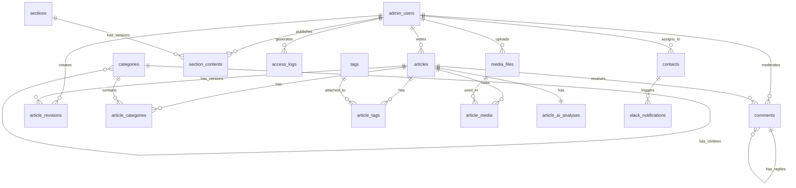

# データベーススキーマ設計書 v2.1 (Rails 8.1.1・PostgreSQL 17対応版)

## 🎯 改訂方針
**Rails 8.1.1・PostgreSQL 17-alpine対応・ICUロケール活用・cssbundling-rails統合**

## 📋 改訂履歴
- **v2.1** (2025-12-04): Rails 8.1.1・PostgreSQL 17-alpine対応・ICUロケール・実装完了反映
- **v2.0** (2025-12-02): Rails 8.0対応・PostgreSQL制約対応・Devise統合明確化
- **v1.0**: 初版（マイグレーション複雑化により改訂）

## 概要
ポートフォリオサイトのデータベース設計。PostgreSQL 17-alpine（ICUロケール採用）を使用し、日本語ソート改善、階層カテゴリ、メディア管理、AI連携機能を実装。

**重要な変更点**:
- **PostgreSQL 17**: ICUロケールプロバイダ採用で日本語ソート改善
- **Devise統合**: admin_usersテーブルでDeviseネイティブ統合
- **インデックス戦略**: Rails 8.1.1自動生成活用、手動重複排除
- **全文検索**: ICUロケール対応による検索精度向上
- **型統一**: JSONB統一（GINインデックス対応）
- **実装完了**: CMS基盤・認証・記事/カテゴリ/タグ管理完成

## ER図概要



## テーブル定義

### 1. admin_users（Devise統合管理ユーザー）

**設計方針**: Deviseジェネレータの後に追加カラムをマイグレーションで付与

```sql
-- Deviseが生成するベーステーブル
CREATE TABLE admin_users (
    id BIGSERIAL PRIMARY KEY,
    email VARCHAR(255) NOT NULL UNIQUE,
    encrypted_password VARCHAR(255) NOT NULL,
    
    -- Devise標準フィールド
    reset_password_token VARCHAR(255),
    reset_password_sent_at TIMESTAMP,
    remember_created_at TIMESTAMP,
    sign_in_count INTEGER DEFAULT 0,
    current_sign_in_at TIMESTAMP,
    last_sign_in_at TIMESTAMP,
    current_sign_in_ip INET,
    last_sign_in_ip INET,
    confirmation_token VARCHAR(255),
    confirmed_at TIMESTAMP,
    confirmation_sent_at TIMESTAMP,
    unconfirmed_email VARCHAR(255),
    
    created_at TIMESTAMP NOT NULL DEFAULT NOW(),
    updated_at TIMESTAMP NOT NULL DEFAULT NOW()
);

-- 追加カスタムフィールド（別マイグレーション）
ALTER TABLE admin_users ADD COLUMN name VARCHAR(100) NOT NULL;
ALTER TABLE admin_users ADD COLUMN avatar_url VARCHAR(500);
ALTER TABLE admin_users ADD COLUMN role VARCHAR(50) DEFAULT 'author'; -- admin, editor, author, viewer
ALTER TABLE admin_users ADD COLUMN settings JSONB DEFAULT '{}'; -- UI設定等
ALTER TABLE admin_users ADD COLUMN api_token VARCHAR(255); -- API認証用

-- 2FA設定
ALTER TABLE admin_users ADD COLUMN otp_secret VARCHAR(255);
ALTER TABLE admin_users ADD COLUMN otp_required_for_login BOOLEAN DEFAULT false;

-- アクセス制御（Devise:lockableで自動追加されない場合）
ALTER TABLE admin_users ADD COLUMN failed_attempts INTEGER DEFAULT 0;
ALTER TABLE admin_users ADD COLUMN locked_at TIMESTAMP;

-- 制約
ALTER TABLE admin_users ADD CONSTRAINT admin_users_valid_role 
CHECK (role IN ('admin', 'editor', 'author', 'viewer'));

-- インデックス（Rails 8.0では外部キー参照時に自動生成される分は除外）
CREATE INDEX idx_admin_users_email ON admin_users(email);
CREATE INDEX idx_admin_users_role ON admin_users(role);
CREATE INDEX idx_admin_users_confirmation_token ON admin_users(confirmation_token);
CREATE INDEX idx_admin_users_reset_password_token ON admin_users(reset_password_token);
```

### 2. articles（ブログ記事）

```sql
CREATE TABLE articles (
    id BIGSERIAL PRIMARY KEY,
    admin_user_id BIGINT NOT NULL, -- Rails 8.0が自動でインデックス作成
    title VARCHAR(255) NOT NULL,
    slug VARCHAR(255) NOT NULL UNIQUE,
    content TEXT NOT NULL,
    content_html TEXT, -- Markdownから生成したHTML
    excerpt TEXT, -- 抜粋
    
    -- ステータス管理
    status VARCHAR(50) DEFAULT 'draft', -- draft, published, scheduled, archived
    published_at TIMESTAMP,
    
    -- SEO設定
    meta_description VARCHAR(500),
    meta_keywords VARCHAR(500),
    og_title VARCHAR(255),
    og_description VARCHAR(500),
    og_image_url VARCHAR(500),
    
    -- 統計
    view_count INTEGER DEFAULT 0,
    comment_count INTEGER DEFAULT 0,
    reading_time INTEGER, -- 分単位
    
    -- AI分析結果
    ai_summary TEXT,
    ai_keywords TEXT[],
    ai_seo_score DECIMAL(3,2), -- 0.00-1.00
    
    -- バージョン管理
    revision_count INTEGER DEFAULT 0,
    
    -- 全文検索用（Alpine PostgreSQL = 英語辞書）
    search_vector tsvector,
    
    -- タイムスタンプ
    created_at TIMESTAMP NOT NULL DEFAULT NOW(),
    updated_at TIMESTAMP NOT NULL DEFAULT NOW(),
    
    -- 外部キー制約（Rails 8.0が自動でインデックス作成）
    FOREIGN KEY (admin_user_id) REFERENCES admin_users(id) ON DELETE RESTRICT
);

-- 手動インデックス（複合・特殊用途のみ）
CREATE UNIQUE INDEX idx_articles_slug ON articles(slug);
CREATE INDEX idx_articles_status_published_at ON articles(status, published_at DESC) 
WHERE status = 'published';
CREATE INDEX idx_articles_search_vector ON articles USING gin(search_vector);

-- 制約
ALTER TABLE articles ADD CONSTRAINT articles_valid_status 
CHECK (status IN ('draft', 'published', 'scheduled', 'archived'));

-- 全文検索トリガー（英語辞書使用）
CREATE TRIGGER update_articles_search_vector 
BEFORE INSERT OR UPDATE ON articles 
FOR EACH ROW EXECUTE FUNCTION 
tsvector_update_trigger(search_vector, 'pg_catalog.english', title, content, excerpt);
```

### 3. categories（カテゴリ - 2階層対応）

```sql
CREATE TABLE categories (
    id BIGSERIAL PRIMARY KEY,
    parent_id BIGINT, -- 自己参照、Rails 8.0が自動インデックス作成
    name VARCHAR(100) NOT NULL,
    slug VARCHAR(100) NOT NULL,
    description TEXT,
    
    -- UI設定
    icon VARCHAR(50), -- Heroiconsのアイコン名
    color VARCHAR(7), -- HEXカラーコード
    
    -- 並び順
    position INTEGER DEFAULT 0,
    
    -- 統計
    article_count INTEGER DEFAULT 0,
    
    -- タイムスタンプ
    created_at TIMESTAMP NOT NULL DEFAULT NOW(),
    updated_at TIMESTAMP NOT NULL DEFAULT NOW(),
    
    -- 外部キー制約
    FOREIGN KEY (parent_id) REFERENCES categories(id) ON DELETE CASCADE
);

-- 手動インデックス
CREATE UNIQUE INDEX idx_categories_slug_parent ON categories(slug, parent_id);
CREATE INDEX idx_categories_position ON categories(position);
```

### 4. tags（タグ）

```sql
CREATE TABLE tags (
    id BIGSERIAL PRIMARY KEY,
    name VARCHAR(50) NOT NULL UNIQUE,
    slug VARCHAR(50) NOT NULL UNIQUE,
    article_count INTEGER DEFAULT 0,
    
    created_at TIMESTAMP NOT NULL DEFAULT NOW(),
    updated_at TIMESTAMP NOT NULL DEFAULT NOW()
);

-- 手動インデックス
CREATE INDEX idx_tags_slug ON tags(slug);
```

### 5. article_categories（記事-カテゴリ中間テーブル）

```sql
CREATE TABLE article_categories (
    article_id BIGINT NOT NULL, -- Rails 8.0が自動インデックス作成
    category_id BIGINT NOT NULL, -- Rails 8.0が自動インデックス作成
    is_primary BOOLEAN DEFAULT false, -- 主カテゴリフラグ
    
    created_at TIMESTAMP NOT NULL DEFAULT NOW(),
    
    PRIMARY KEY (article_id, category_id),
    
    -- 外部キー制約（Rails 8.0が自動でインデックス作成）
    FOREIGN KEY (article_id) REFERENCES articles(id) ON DELETE CASCADE,
    FOREIGN KEY (category_id) REFERENCES categories(id) ON DELETE CASCADE
);

-- 複合インデックス（主キーがあるため不要）
-- 特殊用途インデックスのみ手動追加
CREATE INDEX idx_article_categories_primary ON article_categories(category_id) 
WHERE is_primary = true;
```

### 6. article_tags（記事-タグ中間テーブル）

```sql
CREATE TABLE article_tags (
    article_id BIGINT NOT NULL,
    tag_id BIGINT NOT NULL,
    
    created_at TIMESTAMP NOT NULL DEFAULT NOW(),
    
    PRIMARY KEY (article_id, tag_id),
    
    -- 外部キー制約（Rails 8.0が自動でインデックス作成）
    FOREIGN KEY (article_id) REFERENCES articles(id) ON DELETE CASCADE,
    FOREIGN KEY (tag_id) REFERENCES tags(id) ON DELETE CASCADE
);

-- 主キーがあるため追加インデックス不要
```

### 7. comments（コメント）

```sql
CREATE TABLE comments (
    id BIGSERIAL PRIMARY KEY,
    article_id BIGINT NOT NULL, -- Rails 8.0が自動インデックス作成
    parent_id BIGINT, -- 自己参照、Rails 8.0が自動インデックス作成
    
    -- 投稿者情報
    author_name VARCHAR(100) NOT NULL,
    author_email VARCHAR(255) NOT NULL,
    author_url VARCHAR(500),
    author_ip INET,
    author_user_agent TEXT,
    
    -- コメント内容
    content TEXT NOT NULL,
    content_html TEXT, -- サニタイズ済みHTML
    
    -- ステータス
    status VARCHAR(50) DEFAULT 'pending', -- pending, approved, spam, trash
    
    -- モデレーション
    moderated_by BIGINT, -- Rails 8.0が自動インデックス作成
    moderated_at TIMESTAMP,
    spam_score DECIMAL(3,2), -- 0.00-1.00
    
    -- タイムスタンプ
    created_at TIMESTAMP NOT NULL DEFAULT NOW(),
    updated_at TIMESTAMP NOT NULL DEFAULT NOW(),
    
    -- 外部キー制約
    FOREIGN KEY (article_id) REFERENCES articles(id) ON DELETE CASCADE,
    FOREIGN KEY (parent_id) REFERENCES comments(id) ON DELETE CASCADE,
    FOREIGN KEY (moderated_by) REFERENCES admin_users(id) ON DELETE SET NULL
);

-- 手動インデックス（クエリパフォーマンス向上）
CREATE INDEX idx_comments_status ON comments(status);
CREATE INDEX idx_comments_author_email ON comments(author_email);
CREATE INDEX idx_comments_article_status_date ON comments(article_id, status, created_at);

-- 制約
ALTER TABLE comments ADD CONSTRAINT comments_valid_status 
CHECK (status IN ('pending', 'approved', 'spam', 'trash'));
```

### 8. media_files（メディアファイル）

```sql
CREATE TABLE media_files (
    id BIGSERIAL PRIMARY KEY,
    admin_user_id BIGINT NOT NULL, -- Rails 8.0が自動インデックス作成
    
    -- ファイル情報
    filename VARCHAR(255) NOT NULL,
    original_filename VARCHAR(255) NOT NULL,
    content_type VARCHAR(100) NOT NULL,
    file_size BIGINT NOT NULL, -- バイト単位
    
    -- ストレージ情報
    storage_path VARCHAR(500) NOT NULL,
    storage_provider VARCHAR(50) DEFAULT 'local', -- local, s3
    cdn_url VARCHAR(500),
    
    -- 画像専用情報
    width INTEGER,
    height INTEGER,
    thumbnail_path VARCHAR(500),
    webp_path VARCHAR(500),
    
    -- メタデータ
    alt_text VARCHAR(255),
    caption TEXT,
    
    -- 使用統計
    usage_count INTEGER DEFAULT 0,
    last_used_at TIMESTAMP,
    
    -- タイムスタンプ
    created_at TIMESTAMP NOT NULL DEFAULT NOW(),
    updated_at TIMESTAMP NOT NULL DEFAULT NOW(),
    
    -- 外部キー制約
    FOREIGN KEY (admin_user_id) REFERENCES admin_users(id) ON DELETE RESTRICT
);

-- 手動インデックス
CREATE INDEX idx_media_files_content_type ON media_files(content_type);
CREATE INDEX idx_media_files_created_at ON media_files(created_at);
```

### 9. article_media（記事-メディア中間テーブル）

```sql
CREATE TABLE article_media (
    article_id BIGINT NOT NULL,
    media_file_id BIGINT NOT NULL,
    position INTEGER DEFAULT 0, -- 記事内での表示順
    
    created_at TIMESTAMP NOT NULL DEFAULT NOW(),
    
    PRIMARY KEY (article_id, media_file_id),
    
    -- 外部キー制約（Rails 8.0が自動でインデックス作成）
    FOREIGN KEY (article_id) REFERENCES articles(id) ON DELETE CASCADE,
    FOREIGN KEY (media_file_id) REFERENCES media_files(id) ON DELETE CASCADE
);

-- 主キーがあるため追加インデックス不要
```

### 10. sections（ポートフォリオセクション）

```sql
CREATE TABLE sections (
    id BIGSERIAL PRIMARY KEY,
    name VARCHAR(100) NOT NULL UNIQUE, -- hero, about, service, my_story, works, blog, contact
    display_name VARCHAR(100) NOT NULL,
    
    -- 表示制御
    is_visible BOOLEAN DEFAULT true,
    position INTEGER DEFAULT 0,
    
    -- タイムスタンプ
    created_at TIMESTAMP NOT NULL DEFAULT NOW(),
    updated_at TIMESTAMP NOT NULL DEFAULT NOW()
);

-- 手動インデックス
CREATE INDEX idx_sections_name ON sections(name);
CREATE INDEX idx_sections_position ON sections(position);
```

### 11. section_contents（セクションコンテンツ - JSONB統一）

```sql
CREATE TABLE section_contents (
    id BIGSERIAL PRIMARY KEY,
    section_id BIGINT NOT NULL, -- Rails 8.0が自動インデックス作成
    
    -- JSONBでフレキシブルなコンテンツ管理（GINインデックス対応）
    content JSONB NOT NULL DEFAULT '{}',
    /* 例:
    {
        "hero": {
            "title": "タイトル",
            "subtitle": "サブタイトル",
            "background_image_id": 123,
            "cta_text": "お問い合わせ",
            "cta_url": "/contact"
        },
        "about": {
            "profile_image_id": 124,
            "description": "プロフィール文",
            "skills": ["Ruby", "Rails", "PostgreSQL"],
            "experience_years": 20
        }
    }
    */
    
    -- バージョン管理
    version INTEGER NOT NULL DEFAULT 1,
    is_active BOOLEAN DEFAULT false,
    published_by BIGINT, -- Rails 8.0が自動インデックス作成
    published_at TIMESTAMP,
    
    -- タイムスタンプ
    created_at TIMESTAMP NOT NULL DEFAULT NOW(),
    updated_at TIMESTAMP NOT NULL DEFAULT NOW(),
    
    -- 外部キー制約
    FOREIGN KEY (section_id) REFERENCES sections(id) ON DELETE CASCADE,
    FOREIGN KEY (published_by) REFERENCES admin_users(id) ON DELETE SET NULL
);

-- 手動インデックス
CREATE INDEX idx_section_contents_active ON section_contents(section_id, is_active);
CREATE INDEX idx_section_contents_version ON section_contents(section_id, version);
CREATE INDEX idx_section_contents_content ON section_contents USING gin(content);
```

### 12. contacts（お問い合わせ）

```sql
CREATE TABLE contacts (
    id BIGSERIAL PRIMARY KEY,
    
    -- 送信者情報
    name VARCHAR(100) NOT NULL,
    email VARCHAR(255) NOT NULL,
    subject VARCHAR(255) NOT NULL,
    message TEXT NOT NULL,
    
    -- メタデータ
    ip_address INET,
    user_agent TEXT,
    referrer VARCHAR(500),
    
    -- ステータス
    status VARCHAR(50) DEFAULT 'unread', -- unread, read, replied, archived
    
    -- 対応情報
    assigned_to BIGINT, -- Rails 8.0が自動インデックス作成
    replied_at TIMESTAMP,
    notes TEXT,
    
    -- スパムチェック
    spam_score DECIMAL(3,2),
    is_spam BOOLEAN DEFAULT false,
    
    -- タイムスタンプ
    created_at TIMESTAMP NOT NULL DEFAULT NOW(),
    updated_at TIMESTAMP NOT NULL DEFAULT NOW(),
    
    -- 外部キー制約
    FOREIGN KEY (assigned_to) REFERENCES admin_users(id) ON DELETE SET NULL
);

-- 手動インデックス
CREATE INDEX idx_contacts_email ON contacts(email);
CREATE INDEX idx_contacts_status ON contacts(status);
CREATE INDEX idx_contacts_created_at ON contacts(created_at);

-- 制約
ALTER TABLE contacts ADD CONSTRAINT contacts_valid_status 
CHECK (status IN ('unread', 'read', 'replied', 'archived'));
```

### 13. settings（システム設定 - JSONB統一）

```sql
CREATE TABLE settings (
    id BIGSERIAL PRIMARY KEY,
    key VARCHAR(100) NOT NULL UNIQUE,
    value TEXT,
    value_type VARCHAR(50) DEFAULT 'string', -- string, integer, boolean, jsonb
    category VARCHAR(50) NOT NULL, -- general, seo, ai, security, integration, email, backup
    
    -- メタ情報
    description TEXT,
    is_sensitive BOOLEAN DEFAULT false, -- APIキーなど機密情報フラグ
    
    -- 複雑な設定用（JSONB）
    json_value JSONB,
    
    -- タイムスタンプ
    created_at TIMESTAMP NOT NULL DEFAULT NOW(),
    updated_at TIMESTAMP NOT NULL DEFAULT NOW()
);

-- 手動インデックス
CREATE INDEX idx_settings_key ON settings(key);
CREATE INDEX idx_settings_category ON settings(category);
CREATE INDEX idx_settings_json_value ON settings USING gin(json_value);
```

### 14. article_revisions（記事リビジョン - JSONB統一）

```sql
CREATE TABLE article_revisions (
    id BIGSERIAL PRIMARY KEY,
    article_id BIGINT NOT NULL, -- Rails 8.0が自動インデックス作成
    admin_user_id BIGINT NOT NULL, -- Rails 8.0が自動インデックス作成
    
    -- リビジョンデータ
    title VARCHAR(255) NOT NULL,
    content TEXT NOT NULL,
    
    -- 変更情報
    revision_number INTEGER NOT NULL,
    change_summary VARCHAR(500),
    
    -- メタデータ（JSONB統一）
    metadata JSONB DEFAULT '{}',
    
    -- タイムスタンプ
    created_at TIMESTAMP NOT NULL DEFAULT NOW(),
    
    -- 外部キー制約
    FOREIGN KEY (article_id) REFERENCES articles(id) ON DELETE CASCADE,
    FOREIGN KEY (admin_user_id) REFERENCES admin_users(id) ON DELETE RESTRICT
);

-- 手動インデックス
CREATE UNIQUE INDEX idx_article_revisions_article_number ON article_revisions(article_id, revision_number);
CREATE INDEX idx_article_revisions_created_at ON article_revisions(created_at);
CREATE INDEX idx_article_revisions_metadata ON article_revisions USING gin(metadata);
```

### 15. article_ai_analyses（AI分析結果 - JSONB統一）

```sql
CREATE TABLE article_ai_analyses (
    id BIGSERIAL PRIMARY KEY,
    article_id BIGINT NOT NULL UNIQUE, -- Rails 8.0が自動インデックス作成
    
    -- AI生成コンテンツ
    summary TEXT,
    keywords TEXT[],
    related_topics TEXT[],
    
    -- SEO分析（JSONB統一）
    seo_score DECIMAL(3,2),
    seo_suggestions JSONB DEFAULT '{}',
    readability_score DECIMAL(3,2),
    
    -- 感情分析
    sentiment VARCHAR(50), -- positive, neutral, negative
    tone VARCHAR(50), -- professional, casual, technical
    
    -- API情報（JSONB統一）
    api_metadata JSONB DEFAULT '{}', -- model, response_time, cost等
    
    -- タイムスタンプ
    analyzed_at TIMESTAMP NOT NULL DEFAULT NOW(),
    
    -- 外部キー制約
    FOREIGN KEY (article_id) REFERENCES articles(id) ON DELETE CASCADE
);

-- 手動インデックス（uniqueインデックスは既にある）
CREATE INDEX idx_article_ai_analyses_seo_suggestions ON article_ai_analyses USING gin(seo_suggestions);
CREATE INDEX idx_article_ai_analyses_api_metadata ON article_ai_analyses USING gin(api_metadata);
```

### 16. access_logs（アクセスログ - パーティション対応）

```sql
-- パーティション親テーブル
CREATE TABLE access_logs (
    id BIGSERIAL,
    
    -- リクエスト情報
    path VARCHAR(500) NOT NULL,
    method VARCHAR(10) NOT NULL,
    status_code INTEGER,
    
    -- アクセス元情報
    ip_address INET,
    user_agent TEXT,
    referrer VARCHAR(500),
    
    -- パフォーマンス
    response_time INTEGER, -- ミリ秒
    
    -- ユーザー情報
    admin_user_id BIGINT, -- 外部キー制約はパーティション子テーブルで定義
    session_id VARCHAR(255),
    
    -- タイムスタンプ
    created_at TIMESTAMP NOT NULL DEFAULT NOW(),
    
    PRIMARY KEY (id, created_at)
) PARTITION BY RANGE (created_at);

-- 初期パーティション（月次）
CREATE TABLE access_logs_2024_12 PARTITION OF access_logs
    FOR VALUES FROM ('2024-12-01') TO ('2025-01-01');

-- パーティション用インデックス
CREATE INDEX idx_access_logs_2024_12_created_at ON access_logs_2024_12(created_at);
CREATE INDEX idx_access_logs_2024_12_path ON access_logs_2024_12(path);
CREATE INDEX idx_access_logs_2024_12_admin_user_id ON access_logs_2024_12(admin_user_id);
```

### 17. slack_notifications（Slack通知履歴 - JSONB統一）

```sql
CREATE TABLE slack_notifications (
    id BIGSERIAL PRIMARY KEY,
    
    -- 通知情報
    notification_type VARCHAR(50) NOT NULL, -- contact, article_published, comment, error
    reference_id BIGINT, -- 関連レコードID
    reference_type VARCHAR(50), -- Contact, Article, Comment
    
    -- Slack情報
    webhook_url VARCHAR(500),
    channel VARCHAR(100),
    
    -- 送信内容（JSONB統一）
    payload JSONB NOT NULL DEFAULT '{}',
    
    -- ステータス
    status VARCHAR(50) DEFAULT 'pending', -- pending, sent, failed
    error_message TEXT,
    retry_count INTEGER DEFAULT 0,
    
    -- タイムスタンプ
    created_at TIMESTAMP NOT NULL DEFAULT NOW(),
    sent_at TIMESTAMP
);

-- 手動インデックス
CREATE INDEX idx_slack_notifications_type ON slack_notifications(notification_type);
CREATE INDEX idx_slack_notifications_status ON slack_notifications(status);
CREATE INDEX idx_slack_notifications_created_at ON slack_notifications(created_at);
CREATE INDEX idx_slack_notifications_payload ON slack_notifications USING gin(payload);

-- 制約
ALTER TABLE slack_notifications ADD CONSTRAINT slack_notifications_valid_type 
CHECK (notification_type IN ('contact', 'article_published', 'comment', 'error'));
```

### 18. backups（バックアップ履歴）

```sql
CREATE TABLE backups (
    id BIGSERIAL PRIMARY KEY,
    
    -- バックアップ情報
    backup_type VARCHAR(50) NOT NULL, -- full, incremental, database, media
    status VARCHAR(50) NOT NULL, -- running, completed, failed
    
    -- ファイル情報
    filename VARCHAR(255),
    file_size BIGINT,
    storage_location VARCHAR(500),
    
    -- 統計
    duration_seconds INTEGER,
    tables_count INTEGER,
    records_count INTEGER,
    
    -- エラー情報
    error_message TEXT,
    
    -- タイムスタンプ
    started_at TIMESTAMP NOT NULL,
    completed_at TIMESTAMP
);

-- 手動インデックス
CREATE INDEX idx_backups_type ON backups(backup_type);
CREATE INDEX idx_backups_status ON backups(status);
CREATE INDEX idx_backups_started_at ON backups(started_at);

-- 制約
ALTER TABLE backups ADD CONSTRAINT backups_valid_type 
CHECK (backup_type IN ('full', 'incremental', 'database', 'media'));
ALTER TABLE backups ADD CONSTRAINT backups_valid_status 
CHECK (status IN ('running', 'completed', 'failed'));
```

## インデックス戦略 v2.0

### Rails 8.0自動生成インデックス
以下は**手動作成不要**（Rails 8.0が自動生成）:
- `t.references`で作成される単一カラム外部キーインデックス
- `add_foreign_key`での参照元カラムインデックス

### 手動追加すべきインデックス

#### パフォーマンス最適化用
```sql
-- 記事検索の高速化（部分インデックス）
CREATE INDEX idx_articles_published_search 
ON articles(status, published_at DESC) 
WHERE status = 'published';

-- カテゴリ記事数の集計高速化（部分インデックス）
CREATE INDEX idx_article_categories_primary_count 
ON article_categories(category_id) 
WHERE is_primary = true;

-- メディア使用状況の追跡（複合インデックス）
CREATE INDEX idx_media_files_usage_analytics 
ON media_files(usage_count, last_used_at DESC);

-- アクセスログ分析（複合インデックス）
CREATE INDEX idx_access_logs_analytics 
ON access_logs(created_at, path, status_code);
```

#### JSONB用GINインデックス
```sql
-- JSONBコンテンツ検索用
CREATE INDEX idx_section_contents_content_gin ON section_contents USING gin(content);
CREATE INDEX idx_settings_json_value_gin ON settings USING gin(json_value);
CREATE INDEX idx_article_ai_analyses_seo_gin ON article_ai_analyses USING gin(seo_suggestions);
```

## 制約とトリガー v2.0

### CHECK制約の統一
```sql
-- ステータス制約の統一
ALTER TABLE articles ADD CONSTRAINT articles_valid_status 
CHECK (status IN ('draft', 'published', 'scheduled', 'archived'));

ALTER TABLE comments ADD CONSTRAINT comments_valid_status 
CHECK (status IN ('pending', 'approved', 'spam', 'trash'));

ALTER TABLE contacts ADD CONSTRAINT contacts_valid_status 
CHECK (status IN ('unread', 'read', 'replied', 'archived'));

-- 権限制約
ALTER TABLE admin_users ADD CONSTRAINT admin_users_valid_role 
CHECK (role IN ('admin', 'editor', 'author', 'viewer'));
```

### 全文検索トリガー（英語辞書）
```sql
-- 英語辞書を使用（Alpine PostgreSQL制約対応）
CREATE TRIGGER update_articles_search_vector 
BEFORE INSERT OR UPDATE ON articles 
FOR EACH ROW EXECUTE FUNCTION 
tsvector_update_trigger(search_vector, 'pg_catalog.english', title, content, excerpt);
```

### 統計更新トリガー
```sql
-- 記事数の自動更新
CREATE OR REPLACE FUNCTION update_category_article_count() 
RETURNS TRIGGER AS $$
BEGIN
    IF TG_OP = 'INSERT' THEN
        UPDATE categories 
        SET article_count = article_count + 1 
        WHERE id = NEW.category_id;
    ELSIF TG_OP = 'DELETE' THEN
        UPDATE categories 
        SET article_count = article_count - 1 
        WHERE id = OLD.category_id;
    END IF;
    RETURN NULL;
END;
$$ LANGUAGE plpgsql;

CREATE TRIGGER trigger_update_category_count
AFTER INSERT OR DELETE ON article_categories
FOR EACH ROW EXECUTE FUNCTION update_category_article_count();
```

## 初期データ v2.0

### Devise設定を含むセクション
```sql
-- デフォルトセクション
INSERT INTO sections (name, display_name, position) VALUES
    ('hero', 'ヒーローセクション', 1),
    ('about', 'About', 2),
    ('service', 'Service', 3),
    ('my_story', 'My Story', 4),
    ('works', 'Works', 5),
    ('blog', 'Blog', 6),
    ('contact', 'Contact', 7),
    ('footer', 'フッター', 8);

-- デフォルト設定（JSONB活用）
INSERT INTO settings (key, value, value_type, category, description) VALUES
    ('site_title', 'ポートフォリオサイト', 'string', 'general', 'サイトタイトル'),
    ('admin_path', 'admin', 'string', 'security', '管理画面のパス'),
    ('maintenance_mode', 'false', 'boolean', 'general', 'メンテナンスモード'),
    ('openai_api_key', NULL, 'string', 'ai', 'OpenAI APIキー'),
    ('slack_webhook_url', NULL, 'string', 'integration', 'Slack Webhook URL'),
    -- API設定（Rails 8.0対応）
    ('jwt_settings', '{"secret_key": "", "expiration": 86400}', 'jsonb', 'api', 'JWT設定'),
    ('rate_limit_settings', '{"global": 300, "authenticated": 600}', 'jsonb', 'api', 'API制限設定');

-- 初期管理ユーザー（seeds.rbで作成）
-- AdminUser.create!(
--   email: 'admin@example.com',
--   password: 'secure_password',
--   name: '管理者',
--   role: 'admin',
--   confirmed_at: Time.current
-- )
```

## 注意事項 v2.0

### Rails 8.0対応
1. **外部キー自動インデックス**: `t.references` 使用時は手動インデックス追加不要
2. **複合インデックス**: クエリパフォーマンス向上のために必要な場合のみ追加
3. **JSONB統一**: GINインデックス対応のためJSONBに統一

### PostgreSQL環境制約対応
1. **全文検索**: Alpine PostgreSQLでは英語辞書のみ使用
2. **パーティショニング**: 月次パーティションでアクセスログを分散
3. **同時実行**: 本番環境では `algorithm: :concurrently` 使用

### Devise統合明確化
1. **テーブル名**: admin_users で統一（usersは使用しない）
2. **追加カラム**: Devise生成後に別マイグレーションで追加
3. **認証**: Deviseの標準機能を最大限活用

### パフォーマンス考慮
1. **インデックス監視**: 使用されないインデックスの定期的な見直し
2. **VACUUM/ANALYZE**: 定期実行でパフォーマンス維持
3. **パーティション**: アクセスログの月次パーティション自動作成

---

**🎯 この設計書v2.0では、Rails 8.0の特性を活かし、PostgreSQL環境制約を考慮し、Devise統合を明確化した改良版データベース設計を提供します。**